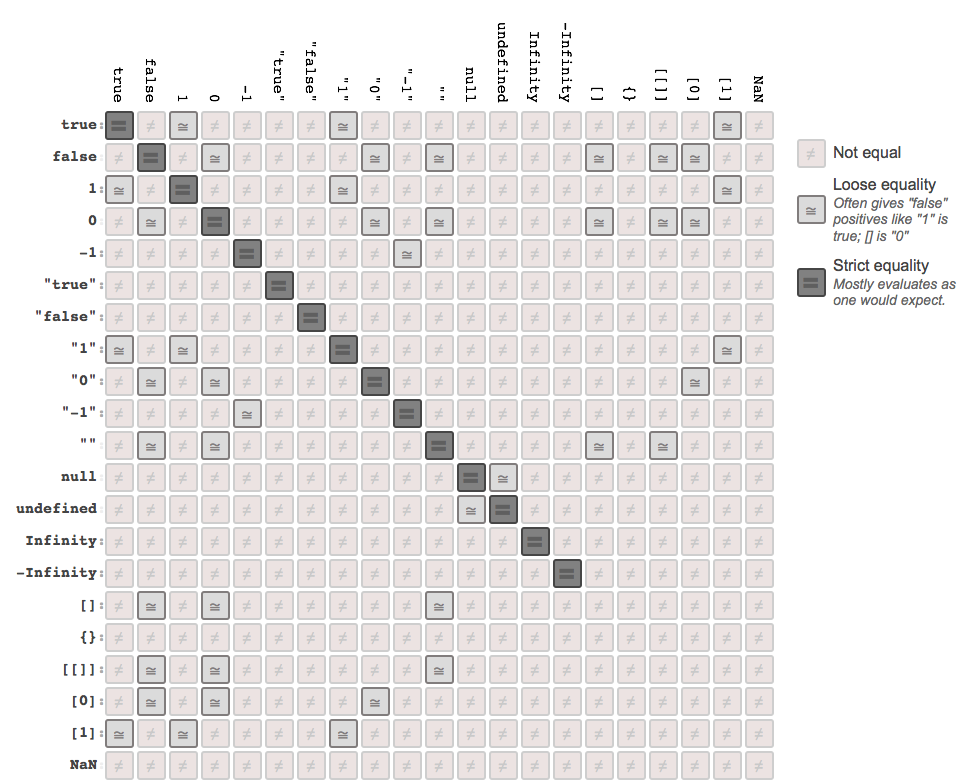

# 你不知道的JavaScript: 类型和语法
# 第四章：coercion

现在，我们已经更加全面了解JavaScript的类型和值，我们把注意力放到一个非常有争议性的话题：coercion。（译者注：coercion，强迫，意译为强制转换，未避免读者误解，不做翻译）

正如我们在第一章提到的，关于coercion是一个非常有用的功能，还是语言的设计缺陷（或介于两者之间！）的争论，从语言设计之初就开始了。如果你已经阅读过一些JS的畅销书，你就知道绝大多数流行的观点是coercion是很神奇的、邪恶的、令人混乱的，是个彻头彻尾的坏主意。

基于本系列书籍的相同精神，不要因为别人这么做，或者你曾经被它的奇怪特性坑过，你就逃离coercion，我认为你应该勇敢面对你不明白的地方，尽全力充分掌握它。

我们的目标是充分发掘coercion的利弊（对，它**的确有**好的一面！），这样你就可以在你的程序中做适当的决定。

## Converting Values

Converting a value from one type to another is often called "type casting," when done explicitly, and "coercion" when done implicitly (forced by the rules of how a value is used).

显式地将一个值从一种类型转换为另外一种类型，通常称为“type casting”。而“coercion”代表隐式的完成这一动作（根据值是如何使用的规则进行强制转换）。

**注意：** 它可能不是很明显，但JavaScript的coercions结果总是原始值之一，比如`string`、`number`或`boolean`。这里不存在coercions的结果是复合值，如`object`或`function`。第三章讲解的“装箱”，能够把原始值包装成它们对应的封装类，准确意义上讲它并不算coercion。

另一种区分这两个概念的方式是：“type casting”（或“type conversion”）发生在静态类型语言的编译阶段，而“type coercion”发生在动态类型语言的运行阶段。

然而，在JavaScript中，大多数人把所有的类型转换都称为**coercion**，而我更喜欢把它们用“implicit coercion”（隐式强制转换）和“explicit coercion”（显式强制转换）区分开。

The difference should be obvious: "explicit coercion" is when it is obvious from looking at the code that a type conversion is intentionally occurring, whereas "implicit coercion" is when the type conversion will occur as a less obvious side effect of some other intentional operation.

这两者的区别显而易见：“explicit coercion”是指当你看代码的时候你就可以发现很明显要进行类型强制转换，而“implicit coercion”是指一些其他的操作引起不太明显的副作用而导致类型强制转换。

例如，考虑如下两种coercion：

```js
var a = 42;

var b = a + "";			// implicit coercion

var c = String( a );	// explicit coercion
```

对于`b`，发生的coercion是隐式的，因为`+`运算符的一个操作符是字符串（`""`），所以它认为这是一个字符串拼接（将两个字符串合并在一起）操作，这个**隐藏的副作用**会强迫数字`42`转换成与之等价的字符串值：`"42"`。

相比之下，`String(..)`函数的意图很明显，它明确的把`a`的值转换成字符串。

两种方法都达到同样的效果：`42`转换成`"42"`。但是，**如何转换**，才是JavaScript coercion激烈辩论的核心。

**注意：** 从技术上讲，在这里有一些细致入微的行为差异超出了形式上的不同（beyond the stylistic difference）。我们会在这章的“Implicitly: Strings <--> Numbers”一节中详细讲解。

The terms "explicit" and "implicit," or "obvious" and "hidden side effect," are *relative*.

术语“显式”和“隐式”，或者“明显的”和“隐藏副作用”是**相对的**。

如果你确切地知道`a + ""`在做什么，你有意这样做，强制将数字转为字符串，你可能会觉得这个操作很“explicit”（“明确的”）。相反，如果你从来没见过`String(..)`函数被用来进行字符串强制转换，它的行为对你来说就很隐蔽，感觉是“implicit”（“隐式的”）。

But we're having this discussion of "explicit" vs. "implicit" based on the likely opinions of an *average, reasonably informed, but not expert or JS specification devotee* developer. To whatever extent you do or do not find yourself fitting neatly in that bucket, you will need to adjust your perspective on our observations here accordingly.

但是，我们关于“explicit”与“implicit”的讨论，是基于**平均水平、合理的通知，但不是专家或JS规范制定者**的开发者的意见。不管你是处于哪种程度的开发者，你都要根据我们的观察来调整你的视角。

请记住：你写的代码只有你一个人阅读，这种情况是非常少见的。即使你是一个对JS来龙去脉都非常精通的专家，请考虑一下你那经验不足的队友阅读你代码时的感受。对你来说是“explicit”或“implicit”的代码，对他们来说还是一样的吗？

## Abstract Value Operations

Before we can explore *explicit* vs *implicit* coercion, we need to learn the basic rules that govern how values *become* either a `string`, `number`, or `boolean`. The ES5 spec in section 9 defines several "abstract operations" (fancy spec-speak for "internal-only operation") with the rules of value conversion. We will specifically pay attention to: `ToString`, `ToNumber`, and `ToBoolean`, and to a lesser extent, `ToPrimitive`.

在我们开始探索**explicit**与**implicit** coercion之前，我们需要学习支配值是如何转换成`string`、`number`或 `boolean`的规则。ES5规范的第九节定义了几种关于值转换的“抽象操作”（规范而言，是“仅供内部使用的操作”）的规则。我们会特别注意：`ToString`、`ToNumber`和`ToBoolean`，从某种程度上说，是`ToPrimitive`。

### `ToString`

当非字符串的值被强制转换为字符串，该转换由抽象操作`ToString`（ES5规范第9.8节）处理。

内置的原始值有自然的字符串化规则：`null`变成`"null"`, `undefined`变成`"undefined"`以及`true`变成`"true"`。`number`以你期望的自然方式转换，但正如我们在第二章中讨论的，非常小或非常大的数字会以指数形式表示：

```js
// multiplying `1.07` by `1000`, seven times over
var a = 1.07 * 1000 * 1000 * 1000 * 1000 * 1000 * 1000 * 1000;

// seven times three digits => 21 digits
a.toString(); // "1.07e21"
```

对于常规的对象，除非你指定你自己的，默认的`toString()`（位于`Object.prototype.toString()`）会返回 **internal `[[Class]]`**（参见第三章），比如：`"[object Object]"`。

但如之前展示的，如果一个对象有自己的`toString()`方法，并且你把该对象以字符串的方式来使用，它的`toString()`方法会被自动调用，并且将这个函数的字符串结果作为替代值。

**注意：** 将对象转换为字符串的方法，技术上来说，是通过抽象操作`ToPrimitive`来完成的（ES5规范，第9.1节），但这些细致入微的细节在本章的后面的`ToNumber`一节中会详细介绍，所以我们在这先跳过。

数组覆盖了默认的`toString()`方法，它会将每个值都转为字符串，然后用`","`将它们连接起来：

```js
var a = [1,2,3];

a.toString(); // "1,2,3"
```

再次说明，`toString()`既可以被明确地调用，也可以在一个非字符串被用于字符串上下文中，被自动调用。

#### JSON Stringification

另外一个与`ToString`非常相关的任务是，当你使用`JSON.stringify(..)`工具序列化一个值为JSON字符串。

需要注意的是，这里的JSON字符串化和coercion并不是完全一样的东西。但因为它和上面的`ToString`规则有关联，我们在这里稍微叉开话题，介绍一下JSON字符串化的行为。

对于大多数简单的值，JSON字符串化的行为与`toString()`的转换是基本相同的，除了`toString()`的序列化结果总是字符串这一点（下面你会看到JSON字符串化的结果不一定为字符串）：

```js
JSON.stringify( 42 );	// "42"
JSON.stringify( "42" );	// ""42"" (a string with a quoted string value in it)
JSON.stringify( null );	// "null"
JSON.stringify( true );	// "true"
```

任何**JSON安全**的值都可以通过`JSON.stringify(..)`转换为字符串。但是，什么是**JSON安全**的值？能够有效用JSON形式表示的任何值。

很容易就想到那些**非**JSON安全的值。例如：`undefined`、`function`、(ES6+) `symbol`以及循环引用的`object`（对象结构的属性引用通过创建彼此，构成一个永无止境的循环）。对一个标准的JSON结构来说，这些值都是非法的，主要是因为它们无法移植都其他支持JSON的语言中。

当`JSON.stringify(..)`遇到`undefined`、`function`和`symbol`的时候，会自动忽略它们的值。如果这样的值在数组中，这个值会被替换成`null`（这样数组的位置信息就不被改变）。如果这样的值出现在对象的属性中，那这个属性会被排除掉。

考虑如下：

```js
JSON.stringify( undefined );					// undefined
JSON.stringify( function(){} );					// undefined

JSON.stringify( [1,undefined,function(){},4] );	// "[1,null,null,4]"
JSON.stringify( { a:2, b:function(){} } );		// "{"a":2}"
```

但是，如果你尝试`JSON.stringify(..)`一个带有循环引用的对象，它就会抛出异常。

JSON字符串化有个特殊的行为，如果一个对象定义了`toJSON()`方法，那这个方法首先被调用，并且将它的返回值进行序列化。

如果你打算将一个含有非法JSON值的对象转换成JSON字符串，或只是你的对象中含有不适合序列化的值，你就应该定义一个`toJSON()`方法，用于返回该对象的**JSON安全**版本

例如：

```js
var o = { };

var a = {
	b: 42,
	c: o,
	d: function(){}
};

// create a circular reference inside `a`
o.e = a;

// would throw an error on the circular reference
// JSON.stringify( a );

// define a custom JSON value serialization
a.toJSON = function() {
	// only include the `b` property for serialization
	return { b: this.b };
};

JSON.stringify( a ); // "{"b":42}"
```

一个非常常见的误解是`toJSON()`应该返回一个对象的字符串表示。这是不对的，除非你确实想将一个字符串再进行字符串化（这很少见！）。`toJSON()`应该返回一个合适的（任何类型的）正常值，而`JSON.stringify(..)`本身会处理字符串化的工作。

换句话说，`toJSON()`应该被解释为“返回一个适合进行字符串化的JSON安全值”，而不是“返回一个JSON字符串”（很多的开发者错误地认为就是这样）。

考虑：

```js
var a = {
	val: [1,2,3],

	// probably correct!
	toJSON: function(){
		return this.val.slice( 1 );
	}
};

var b = {
	val: [1,2,3],

	// probably incorrect!
	toJSON: function(){
		return "[" +
			this.val.slice( 1 ).join() +
		"]";
	}
};

JSON.stringify( a ); // "[2,3]"

JSON.stringify( b ); // ""[2,3]""
```

在第二次调用中，我们将返回的字符串（而不是数组本身）进行字符串化，这可能不是我们想做的事。

既然我们在谈论`JSON.stringify(..)`，让我们讨论一些鲜为人知但却非常有用的功能，一般人我不告诉他：）

An optional second argument can be passed to `JSON.stringify(..)` that is called *replacer*. This argument can either be an `array` or a `function`. It's used to customize the recursive serialization of an `object` by providing a filtering mechanism for which properties should and should not be included, in a similar way to how `toJSON()` can prepare a value for serialization.

`JSON.stringify(..)`第二个参数是个可选参数，被称为**replacer**。这个参数可以是**数组**或**函数**。它提供了一个过滤机制指定了应该或不应该包含哪些属性，从而实现了对象的可定制的递归序列化，这种做法和`toJSON()`如何为序列化准备一个值很相似。

如果**replacer**是一个数组，它应该是一个字符串数组，每个值都指定了一个对象的属性名称，代表该属性应该被加入到序列化中。如果一个属性不在这个列表中，它会被跳过。

如果**replacer**是一个函数，它首先会被该对象本身调用一次，然后该对象的每个属性会调用一次，每次都会给这个函数传递两个值，**key** 和 **value**。想在序列化过程中跳过某个 **key**，只需返回`undefined`。否则，返回提供的 **value**。

```js
var a = {
	b: 42,
	c: "42",
	d: [1,2,3]
};

JSON.stringify( a, ["b","c"] ); // "{"b":42,"c":"42"}"

JSON.stringify( a, function(k,v){
	if (k !== "c") return v;
} );
// "{"b":42,"d":[1,2,3]}"
```

**注意：** 在 **replacer** 为函数的例子中，参数`k`第一次调用的时候值是`undefined`（第一次是`a`对象本身被传递进去）。`if`语句 **过滤掉** 名称为`"c"`的属性。字符串化是递归进行的，所以数组`[1,2,3]`中的每个值（`1`、`2`和`3`）都被传递给 **replacer** 的参数`v`，对应的下标（`0`、`1`和`2`）作为参数`k`。

第三个可选的参数也可以传递给`JSON.stringify(..)`，被称为 **space** ，被用作缩进，是为了使得输出更加漂亮和人性化。**space** 可以是一个正整数，指定每层缩进应该缩进多少个空格。或者，**space** 也可以是个字符串，其值的前十个字符被用于每个缩进层次。

```js
var a = {
	b: 42,
	c: "42",
	d: [1,2,3]
};

JSON.stringify( a, null, 3 );
// "{
//    "b": 42,
//    "c": "42",
//    "d": [
//       1,
//       2,
//       3
//    ]
// }"

JSON.stringify( a, null, "-----" );
// "{
// -----"b": 42,
// -----"c": "42",
// -----"d": [
// ----------1,
// ----------2,
// ----------3
// -----]
// }"
```

请记住，`JSON.stringify(..)`并不是coercion的一种形式。我们就讲解到这，然而，有两个原因把它的行为和`ToString`的coercion相关联：

1. `string`、`number`、`boolean`和`null`值的JSON字符串化和通过`ToString`抽象操作规则强制转换为字符串值是基本一样的。
2. 如果你传递一个对象给`JSON.stringify(..)`，并且该对象有一个`toJSON()`方法，`toJSON()`会在序列化之前自动调用，将该值（在某种程度上）“coerce”（翻译：强制转换）成一个 **JSON安全** 的值

### `ToNumber`

如果任何非数字的值被用于要求是数字的操作，如数学运算，在ES5规范的9.3节中定义了`ToNumber`抽象操作。

例如，`true`变成`1`以及`false`变成`0`。`undefined`变成`NaN`，但是（很奇怪地）`null`变成了`0`。

`ToNumber` for a `string` value essentially works for the most part like the rules/syntax for numeric literals (see Chapter 3). If it fails, the result is `NaN` (instead of a syntax error as with `number` literals). One example difference is that `0`-prefixed octal numbers are not handled as octals (just as normal base-10 decimals) in this operation, though such octals are valid as `number` literals (see Chapter 2).

对大部分符合数字字面量规则/语法（参见第三章）的字符串值，都可以与`ToNumber`工作的很好。如果失败，其结果是`NaN`（而不是报数字字面量相关的语法错误）。一个不同的例子是，前缀是`0`的八进制数字在此操作中不会被当作八进制处理（而是当作正常的十进制），尽管这种格式在数字字面量中是合法的（参见第二章）。

**注意：** 数字字面量语法和字符串值经过`ToNumber`之后的结果，二者之间的差异是极其微妙的，因而不会在这里进一步讲解。有关更多信息，请参考ES5规范的第9.3.1节。

对象和数组首先被转化为与它们等价的原始值，得到的结果值（如果还不是一个数字）会根据刚才提到的`ToNumber`规则强制转换为数字。

要等价的转换这个原始值，`ToPrimitive`抽象操作（ES5规范，第9.1节）会查询这个值（使用内部的`DefaultValue`操作——ES5规范，第8.12.8节）是否有`valueOf()`方法。如果`valueOf()`方法存在并且返回一个原始值，这个值会被用于coercion。如果不是，并且`toString()`方法存在，那它提供的值会被用于coercion。

如果没有操作可以提供原始值，就会抛出`TypeError`异常。

在ES5中，你可以创建一个不可转换的对象——一个没有`valueOf()`和`toString()`方法的对象——并且它的原型为`null`，通常可以通过`Object.create(null)`来创建这么一个对象。参见本系列标题为**this和对象原型**以获取更多有关原型的信息。

**注意：** 我们会在本章后面详细讲解如何强制转为数字，下面这段代码只是认为函数`Number(..)`做了此项工作。

考虑如下：

```js
var a = {
	valueOf: function(){
		return "42";
	}
};

var b = {
	toString: function(){
		return "42";
	}
};

var c = [4,2];
c.toString = function(){
	return this.join( "" );	// "42"
};

Number( a );			// 42
Number( b );			// 42
Number( c );			// 42
Number( "" );			// 0
Number( [] );			// 0
Number( [ "abc" ] );	// NaN
```

### `ToBoolean`

接下来，让我们聊一聊在JS中`boolean`的行为。关于这个话题，会有 **许多的混乱和误解** 飘出来，所以请密切关注！

首先，JS确实有关键字`true`和`false`，并且它们表现得完全如你所期望的`boolean`值。一个最普遍的误解是，`1`和`0`与`true`和`false`是等价的。虽然这在其他的语言中可能是对的，但在JS中，数字就是数字，布尔就是布尔。你可以强制`1`转换成`true`（反之亦然）或`0`转换成`false`（反之亦然）。但是，它们绝对不是一样的。

#### Falsy Values

But that's not the end of the story. We need to discuss how values other than the two `boolean`s behave whenever you coerce *to* their `boolean` equivalent.

但是，这并不是故事的结束。我们不是要讨论两个`boolean`值的行为，而是讨论其他值如何强制转换为与它们等价的`boolean`值。

所有的JavaScript值可以分为两类：

1. 被强制转换成`boolean`，结果为`false`的值
2. 剩余其他值（强制转换结果为`true`）

我不是在开玩笑。JS规范中定义了一个具体的小范围的值，当它们被强制转为`boolean`类型，会被转换成`false`。

我们怎么知道这个值列表？在ES5规范中，第9.2节定义了`ToBoolean`抽象操作，它说明了所有可能的值在强制转为`boolean`时会发生什么。

从那个表中，我们得到了一下所谓的“假值”列表：

* `undefined`
* `null`
* `false`
* `+0`, `-0`, and `NaN`
* `""`

就这些了。如果一个值在这个列表中，它就是一个“falsy”值，如果你强制将它转换成`boolean`，你会得到`false`。

By logical conclusion, if a value is *not* on that list, it must be on *another list*, which we call the "truthy" values list. But JS doesn't really define a "truthy" list per se. It gives some examples, such as saying explicitly that all objects are truthy, but mostly the spec just implies: **anything not explicitly on the falsy list is therefore truthy.**

显而易见，如果一个值 **不在** 那个列表中，那它肯定在 **另一个列表中**，我们称之为“truthy”值列表。但是JS并没有真正定义“truthy”列表。它提供了一些例子，例如明确规定所有的对象都是“truthy”，其实这个规范的意思就是：**所有不在falsy列表中的值都是truthy。**

#### Falsy Objects

且慢，这节的标题似乎有点自相矛盾。我 **刚刚说过** JS规范中要求所有的对象都是truthy，对不对？所以这不应该有“falsy object”。

那可能意味着什么？

你也许会认为这意味着一个falsy value（如`""`、`0`或`false`）的对象包装类（参见第三章）。但是，不要落入 **陷阱**。

**注意：** 你可能会得到一个微妙的规范玩笑。

考虑如下：

```js
var a = new Boolean( false );
var b = new Number( 0 );
var c = new String( "" );
```

我们知道，这三个值都是明显的假值的包装对象。但是这些对象表现为`true`或`false`呢？这很容易回答：

```js
var d = Boolean( a && b && c );

d; // true
```

所有三个都表现为`true`，所有`d`的结果只能为`true`。

**提示：** 请注意包裹`a && b && c`的那个`Boolean( .. )`表达式——你可能想知道为什么它在那里。我们会在本章后面讲解，所以你先记在脑子里。想要抢先看，试试不带上`Boolean( .. )`来调用`d = a && b && c`，看看`d`的结果是什么。

所以，如果“falsy objects” **不是包裹假值的对象**，那它究竟是什么鬼？

最蛋疼的地方是，它们可以在你的JS程序中显式出来，但它们并不是真正的JavaScript的一部分。

**开始进入懵逼状态：）**

There are certain cases where browsers have created their own sort of *exotic* values behavior, namely this idea of "falsy objects," on top of regular JS semantics.

有些情况下，浏览器会创建自己的那种 **异国情调** 的值行为，把这个想法取名为“falsy objects”，在正规JS语义之上定义的。

一个“falsy object”是一个值，它的外观和行为都表现得像一个正常的对象（或属性等），但是当你把它强制转换为`boolean`，它会被转成`false`。

**为什么！？**

The most well-known case is `document.all`: an array-like (object) provided to your JS program *by the DOM* (not the JS engine itself), which exposes elements in your page to your JS program. It *used* to behave like a normal object--it would act truthy. But not anymore.

最著名的例子是`document.all`：它是由 **DOM提供**（不是JS引擎本身提供的）给你的JS程序的一个类数组对象，它把当前页面的元素暴露给你的JS程序。它 **曾经** 表现得像个正常的对象——它表现得truthy。但现在不是了。

`document.all`本身从来就不是真正的 **标准**，并且它早已经被弃用了。

“难道就不能把它移除掉吗？”对不起，这是个不错的尝试。我也希望他们能。但是这里有太多太多遗留的JS代码，都依赖于它才能运行。

那为什么要让它表现的像假值？因为将`document.all`强制转换成`boolean`（比如在`if`语句中），经常被用于检测老版本的非标准IE。（译者注：没错，IE又出来实力坑你一波！）

IE has long since come up to standards compliance, and in many cases is pushing the web forward as much or more than any other browser. But all that old `if (document.all) { /* it's IE */ }` code is still out there, and much of it is probably never going away. All this legacy code is still assuming it's running in decade-old IE, which just leads to bad browsing experience for IE users.

在符合标准之前，IE已经存在很久了，在许多情况下它推动Web向前发展，并不比其他任何浏览器少。但是所有的老的`if (document.all) { /* it's IE */ }`代码仍然在那里，大部分可能永远不会消失。所有这些遗留代码仍然假设它是运行在十年之前的IE上，这导致了IE用户不好的浏览体验。

因此，我们不能完全移除`document.all`，但IE不想让`if (document.all) { .. }`代码继续工作，这样新的IE的用户就可以获得新的符合标准的代码逻辑。

“我们应该这么做？”“我知道了！让我们bastardize（退化、变劣）JS类型系统，假装`document.all`是falsy！”

Ugh. That sucks. It's a crazy gotcha that most JS developers don't understand. But the alternative (doing nothing about the above no-win problems) sucks *just a little bit more*.

噢，真他妈的坑爹！大多数的JS开发者并不了解这个疯狂的疑难杂症。但另一种做法（对上面的问题不做任何处理）会稍微更坑一点。

所以......这就是我们得到的：疯狂的、非标准的“falsy objects”，通过浏览器添加到JavaScript中。“IE棒棒哒！！！”

#### Truthy Values

回到truthy列表。究竟什么值是truthy？记住：**不在falsy列表中的值都是truthy。**

考虑如下：

```js
var a = "false";
var b = "0";
var c = "''";

var d = Boolean( a && b && c );

d;
```

你觉得这里的`d`的值是什么？它肯定是`true`或`false`。

答案是`true`。为什么？因为这些字符串的值尽管看起来像假值，但是字符串本身是truthy，因为`""`是唯一在假值列表中的字符串。

那这些的结果是什么？

```js
var a = [];				// empty array -- truthy or falsy?
var b = {};				// empty object -- truthy or falsy?
var c = function(){};	// empty function -- truthy or falsy?

var d = Boolean( a && b && c );

d;
```

是的，你猜对了，`d`在这是还是`true`。为什么？与上面的理由是一样的。尽管它们看起来像假值，但是`[]`、`{}`和`function(){}` **并不在** 假值列表中，所以它们是truthy values。

换句话说，truthy 列表是无限长。做出这样的名单是不可能的。你只能做出有限的falsy列表，请参阅 **它**。

请花五分钟将假值列表写在便签纸上，贴在你的电脑显示器上，或者，如果你愿意，就记住它。无论哪种方式，你会很容易能够建立一个虚拟的truthy列表，只要看它是不是在这个假值列表上。

truthy和falsy的重要性在于理解当一个值（显式或隐式）强制转换成`boolean`值的时候，它会如何表现。现在，既然你已经对这两个列表了然于胸，我们就可以深入了解强制转换的例子了。

## Explicit Coercion（显式转换）

*Explicit* coercion refers to type conversions that are obvious and explicit. There's a wide range of type conversion usage that clearly falls under the *explicit* coercion category for most developers.

**Explicit** coercion 指的是明显和显式的转换。对大多数开发者来说，**Explicit** coercion 中有多种类型转换的用法很明显是下降的。（最后一句确实不明白是什么意思，请自行理解）

这里的目标是确定我们的代码模式，我们可以说清楚并且很明显得看出我们正在将值从一种类型转成另一种类型，避免给未来的开发者留坑。我们写的代码越明确，就越可能后来的人就能够阅读我们的代码并且不费力气就能明白我们的意图。

你很难找到关于 **explicit** coercion 任何突出的分歧，因为它和静态类型语言的行为十分相似，而静态类型语言的行为是大家普遍接受的做法。因此，我们现在会想当然的同意 **explicit** coercion 不是邪恶的或有争议性的这个观点。我们之后会重温一下：）

### Explicitly: Strings <--> Numbers

我们以最简单也最常用的coercion操作开始：字符串和数字之间的强制转换。

为了在字符串和数字之前强制转换，我们使用内置的`String(..)`和`Number(..)`函数（就是我们在第三章中提到过的“native constructors”），但 **非常重要的是**，我们不会在它们前面使用`new`关键字。因此，我们并不是在创建包装对象（object wrappers）。

相反，我们实际上是在两个类型之间进行 **显式强制转换**：

```js
var a = 42;
var b = String( a );

var c = "3.14";
var d = Number( c );

b; // "42"
d; // 3.14
```

`String(..)`将其他任何值强制转换成原始的字符串值，使用的是我们之前讨论过的`ToString`规则。`Number(..)`将其他任何值强制转换成原始的数字值，使用的是我们之前讨论过的`ToNumber`规则。

我把它称为 **explicit** coercion，因为在一般情况下，对大多数开发者来说，这些操作的最终结果很明显，就是我们所使用的函数的类型转换结果。

事实上，这种用法看起来很像它是在其他一些静态类型语言中所做的。

例如，在C/C++中，你可以使用`(int)x`或`int(x)`，这二者都会将`x`中的值转换成整数。这两种形式都是有效的，但很多人喜欢后者，因为它看起来很像一个函数调用。在JavaScript中，当你使用`Number(x)`，它看起来非常相似。在JS中，它是不是一个函数调用，其实并不重要。

除了`String(..)`和`Number(..)`，还有其他的方式可以 **明确地** 在`string`和`number`之间进行转换。

```js
var a = 42;
var b = a.toString();

var c = "3.14";
var d = +c;

b; // "42"
d; // 3.14
```

调用`a.toString()`表面上是明确的（很明显，“toString”的意思就是“to a string”），但是这里面有一些隐藏的隐式操作。**原始值**，如`42`，并不能调用`toString()`方法。因此，JS会对`42`自动“装箱”（参见第三章），转换成一个封装对象，这样这个封装对象就能调用`toString()`方法了。换句换说，你可以称之为“explicitly implicit”（显式的隐式）。

`+c`在这里显示了`+`操作符的 **一元操作符** 形式（操作符只有一个操作数）。这不是执行数学加法（或字符串拼接——见下文），一元的`+`显式的将操作数（`c`）强制转换成`number`值。

`+c`是 **explicit** coercion吗？取决于你的经验和观点。如果你知道（当然，你现在肯定知道了）一元的`+`是用来显式强制转成`number`，那么这是很明确和明显的。然而，如果你从来没有见过它，那它看起来就非常混乱，隐式的，带有隐藏的副作用，等等。

**注意：** 在JS开源社区，普遍接受的观点是，一元`+`是一种可接受的 **explicit** coercion的形式。

即使你真的喜欢`+c`的形式，但在有些地方，它看起来非常的混乱。考虑如下：

```js
var c = "3.14";
var d = 5+ +c;

d; // 8.14
```

一元操作符`-`的强制转换功能和`+`类似，但是它会翻转数字的符号。但是，你不能把两个`--`放在一起来抵消符号翻转，因为它会被解析为递减操作符。相反，你可以使用`- -"3.14"`，在两者之间留一个空格，这个强制转换的结果是`3.14`。

你也许能想到各种各样的二元运算符（如，用于加法运算的`+`）与一元形式的运算符的丑陋组合。下面是另一个疯狂的例子：

```js
1 + - + + + - + 1;	// 2
```

你应该认真考虑避免使用一元`+`（或`-`）进行强制转换，当它紧靠着其他操作符的时候。尽管上述的作品能够工作，但它被普遍认为是一个坏主意。尽管`d = +c`（或`d =+ c`）很容易被混淆为`d += c`，但二者是完全不同的！

**注意：** 另一个极为困惑的地方是，一元`+`和递增操作符`++`与递减操作符`--`相邻使用。例如：`a +++b`、`a + ++b`和`a + + +b`。参见第五章的“Expression Side-Effects”详细了解`++`。

请记住，我们正在尝试变得明确，**减少** 混乱，而不是使情况变得更糟糕！

#### `Date` To `number`

一元`+`操作符的另外一个常见的用法是将一个`Date`对象强制转换成`number`，转换的结果是unix时间戳（当前时间距离1970年1月1日00:00:00 UTC的毫秒数），代表当前的日期/时间值：

```js
var d = new Date( "Mon, 18 Aug 2014 08:53:06 CDT" );

+d; // 1408369986000
```

这种惯用语法最常见的用法是获取**当前时刻**的时间戳，如：

```js
var timestamp = +new Date();
```

**注意：** 一些开发者都知道在JavaScript中有个特殊的语法“技巧”，就是在构造函数调用（用`new`调用一个函数）中，如果没有参数需要传递，那`()`就是 **可选** 的。所以，你可能会看到`var timestamp = +new Date;`这种形式的调用。然而，并非所有的开发者都认为省略`()`提高了代码的可读性，因为它是一种不常见的语法异常，它只能用于`new fn()`这种调用形式，而不能用于`fn()`常规的调用形式。

coercion 并不是获取`Date`对象的时间戳的唯一途径。一个noncoercion（非coercion）的方式是更可取的，因为它更明确表现我们的意图：

```js
var timestamp = new Date().getTime();
// var timestamp = (new Date()).getTime();
// var timestamp = (new Date).getTime();
```

但是，一个 **更好的** 非强制选项是使用ES5添加的`Date.now()`静态函数：

```js
var timestamp = Date.now();
```

如果你想polyfill `Date.now()`到老版本的浏览器中，也很简单：

```js
if (!Date.now) {
	Date.now = function() {
		return +new Date();
	};
}
```

我建议你跳过有关日期强制转换的形式。使用`Date.now()`获取 **当前** 的时间戳，使用`new Date( .. ).getTime()`获取你指定的 **非当前** 日期/时间的时间戳。

#### The Curious Case of the `~`

一个常常被忽视，通常令人感到困惑的JS强制操作的运算符，是波浪`~`操作符（又名“按位非”）。很多的人，甚至明白它的作用，在很多时候还是想避免它。但坚持我们在这本书和本系列的精神，让我们深入进去，看看`~`有没有给我们什么有用的东西。

在第二章的“32-bit (Signed) Integers”这节，我们讨论了在JS中位运算符只在32位运算中被定义了，这意味着它们会迫使它们的操作数符合32位值的表示。如何发生这些操作的规则，是由`ToInt32`抽象操作控制的（ES5规范，第9.5节）。

`ToInt32`首先做了`ToNumber` coercion，这意味着如果值是`"123"`，它首先会转成`123`，然后再应用`ToInt32`的规则。

**技术上来说**，这并不是coercion（因为类型没有发生改变！），在某些特殊`number`值上，使用位运算符（如`|`或`~`）会产生一种强制转换的效果，从而产生一个不同的`number`值。

例如，让我们先考虑“按位或”`|`运算符，它的一个惯用语法是`0 | x`，它（正如第二章说展示的）基本上只做了`ToInt32`转换：

```js
0 | -0;			// 0
0 | NaN;		// 0
0 | Infinity;	// 0
0 | -Infinity;	// 0
```

这些特殊数字不是32位表示的（因为它们来自64位 IEEE 754标准——见第二章），因此`ToInt32`只是指定`0`作为这些数字的返回值。

`0 | __`这种强制转换的`ToInt32`操作，是 **显式的**，还是 **隐式的**，这一点值得商榷。从规范的角度看，这毫无疑问是 **显式的**，但是如果你不了解这个级别的位运算，那它看起来是更加的 **隐式**，更加的神奇。尽管如此，为保持与本章其他的断言一致，我们把它称为 **显式的**。

让我们把注意力转回到`~`。`~`运算符首先“强制转换”成32位`number`值，然后执行按位非（翻转每个位的奇偶）。

**注意：** 这跟`!`的操作很相似，`!`不仅将值强制转成`boolean`，还会翻转它的奇偶位（见后面的讨论，“unary `!`”）。

但是，我们为什么要关心位的翻转？这是一些非常专业化，细致入微的东西。对JS开发者来说，需要推理各个位是非常罕见的。

换一种方式思考`~`，来自老牌的计算机科学或离散数学的定义：`~`执行执行二进制补码。太好了，谢谢，这样理解就很清晰了！

让我们再试一次：`~x`和`-(x+1)`是大致相同的。这很奇怪，但是比较容易推理。如：

```js
~42;	// -(42+1) ==> -43
```

你可能仍然不知道到底这一切`~`东西是什么，或者为什么在讨论coercion的时候讨论它。让我们快速切入主题：）

考虑`-(x+1)`。哪个值能够通过这个操作产生结果`0`（技术上讲应该是`-0`）？`-1`。换句话说，`~`与`number`值一起使用，对于数字`-1`会产生一个falsy（可以被强制转成`false`）的`0`值，对于其他数字，会产生一个truthy的`number`。

这和我们的疑问有什么关联吗？

`-1` is commonly called a "sentinel value," which basically means a value that's given an arbitrary semantic meaning within the greater set of values of its same type (`number`s). The C-language uses `-1` sentinel values for many functions that return `>= 0` values for "success" and `-1` for "failure."

`-1`通常称为“标记值”（“sentinel value”），这意味着比它同类型（`number`）的值多给了它一个任意语义的值。C语言在很多函数中使用了`-1`标记值，返回`>= 0`的值表示操作成功，返回`-1`表示操作失败。

JavaScript在定义字符串操作`indexOf(..)`的时候采取了这种先例，当它搜索一个子串，如果找到就返回它从0开始的索引位置，没找到就返回`-1`。

尝试使用`indexOf(..)`不只是作为获取位置的操作，还可以做一个布尔检查，判断一个字符串是否在另一个字符串当中，这种做法很常见。以下是开发者经常做的检测：

```js
var a = "Hello World";

if (a.indexOf( "lo" ) >= 0) {	// true
	// found it!
}
if (a.indexOf( "lo" ) != -1) {	// true
	// found it
}

if (a.indexOf( "ol" ) < 0) {	// true
	// not found!
}
if (a.indexOf( "ol" ) == -1) {	// true
	// not found!
}
```

当我看到`>= 0`或`== -1`总感觉很恶心。这是一种“抽象泄漏”，因为在我的代码中，它泄漏了底层实现的行为——使用`-1`标记“失败”。我更喜欢隐藏这种实现细节。

And now, finally, we see why `~` could help us! Using `~` with `indexOf()` "coerces" (actually just transforms) the value **to be appropriately `boolean`-coercible**:

而现在，我们终于明白为什么`~`可以帮助我们！使用`~`和`indexOf()`把值“强制转换”（其实只是变换）成 **合适的`boolean`** ：

```js
var a = "Hello World";

~a.indexOf( "lo" );			// -4   <-- truthy!

if (~a.indexOf( "lo" )) {	// true
	// found it!
}

~a.indexOf( "ol" );			// 0    <-- falsy!
!~a.indexOf( "ol" );		// true

if (!~a.indexOf( "ol" )) {	// true
	// not found!
}
```

运算符`~`将`indexOf(..)`的返回值进行转换：对于“失败”的 `-1`我们得到了falsy值`0`，而其他的值都是truthy。

**注意：** 伪算法`-(x+1)`只是意味着`~-1`的结果是`-0`，但实际上它会得到`0`是因为底层的操作实际上是位运算，而不是数学运算。

从技术上讲，`if (~a.indexOf(..))`仍然是依靠 **implicit** coercion，将`0`转成`false`，或将非零转成`true`。但总体而言，对我来说`~`更像是一个 **explicit** coercion机制，只要你知道这种语法形式是要做什么。

相比之前的`>= 0` / `== -1`的杂乱，我觉得现在的代码更整洁。

##### Truncating Bits

在代码中你会遇到`~`还可能出现在一个地方：有些开发者会使用双波浪线`~~`截断数字的小数部分（即“强制”将一个数字转成“整数”）。很多人认为它和调用`Math.floor(..)`的结果是一样的（这是错误的想法）。

双波浪`~~`的工作原理是：首先右边的`~`应用`ToInt32` “coercion”，并执行按位翻转，然后左边的`~`做第二次按位翻转，翻转所有位回到原来的状态。最终的结果是`ToInt32` “coercion”（又名截断）。

**注意：** `~~`的按位双翻转和双重否定`!!`的行为十分相似，我们会在之后的章节“Explicitly: * --> Boolean”详细解释。

然而，你需要特别小心`~~`。第一，它只在32位值上能够可靠地工作。但更重要的是，它在负数上的作用结果和`Math.floor(..)`是不一样的！

```js
Math.floor( -49.6 );	// -50
~~-49.6;				// -49
```

撇开它与`Math.floor(..)`的差异不谈，`~~x`能够截断数字成32位整数。但是`x | 0`也能做到，而且似乎花费 **较少的努力**。

那你为什么会选择`~~x`而不是`x | 0`呢？因为 **运算符优先级**（见第五章）：

```js
~~1E20 / 10;		// 166199296

1E20 | 0 / 10;		// 1661992960
(1E20 | 0) / 10;	// 166199296
```

正如这里其他方面的建议，只有当大家正确认识到这些运算符是如何工作的，才能把`~`和`~~`作为显式强制转换和值转换的机制用于你的代码中。

### Explicitly: Parsing Numeric Strings

A similar outcome to coercing a `string` to a `number` can be achieved by parsing a `number` out of a `string`'s character contents. There are, however, distinct differences between this parsing and the type conversion we examined above.

类似的结果在强制将`string`转成`number`时，可以通过从一个`string`字符内容中解析出一个`number`来实现。这种解析和我们上面提到的类型转换之间有明显的差异。

考虑如下：

```js
var a = "42";
var b = "42px";

Number( a );	// 42
parseInt( a );	// 42

Number( b );	// NaN
parseInt( b );	// 42
```

从字符串中解析出数字，能够容忍非数字字符的存在——它只是从左到右开始解析，遇到非数字字符就停止解析——而coercion **无法容忍** 非数字，所以会失败，产生结果值`NaN`。

解析不应该被看作是coercion的替代品。这两个任务，尽管很相似，但有不同的用途。当你不知道或不关心可能出现在右边的非数字字符，你就可以从一个`string`中解析出`number`。强制`string`转成`number`是在可接受的值只有数字的情况下使用，像`"42px"`这种字符串应该直接拒绝转成`number`。

**提示：** `parseInt(..)`有一个双胞胎，`parseFloat(..)`，它能从一个字符串中解析出浮点数。

不要忘了`parseInt(..)`只对`string`值进行操作。传递一个`number`值给`parseInt(..)`是完全没有意义的。同理，传递其他类型的值，如`true`、`function(){..}`或`[1,2,3]`，也是没意义的。

如果你传递一个非字符串，这个值首先会被自动强制转成字符串（参见前面的“`ToString`”），这显然是一个隐藏的 **implicit** coercion。让你的程序依赖这样一个行为，这是一个非常糟糕的主意，所以千万不要传递非字符串值给`parseInt(..)`。

ES5之前，`parseInt(..)`存在一个神坑，它是很多JS程序bug的根源。如果你没有传递第二个参数来指定数字的基数（即指定数字是多少进制），用于解析数字字符串内容，`parseInt(..)`会检测开始的字符进行推测。

如果前两个字符是`"0x"`或`"0X"`，它会猜测（按照约定）你想解释字符串为十六进制数字。否则，如果第一个字符是`"0"`，它会猜测（再次，按照约定）你想解释字符串为八进制数字。

十六进制字符串（以`0x`或`0X`开头）并不容易搞混。但是八进制猜测被证明是十分容易搞混。例如：

```js
var hour = parseInt( selectedHour.value );
var minute = parseInt( selectedMinute.value );

console.log( "The time you selected was: " + hour + ":" + minute);
```

似乎人畜无害的，对不对？请尝试选择`08`作为小时和`09`作为分钟。你会得到`0:0`。为什么？因为在八进制中，`8`和`9`都不是有效的字符。

在ES5之前，修复这个bug也很简单，但也很容易忘记：**总是传递`10`作为第二个参数**。这是完全安全的：

```js
var hour = parseInt( selectedHour.value, 10 );
var minute = parseInt( selectedMiniute.value, 10 );
```

在ES5中，`parseInt(..)`不会再猜测八进制了。除非你指定，否则，它假定是十进制（前缀是`"0x"`就假定为十六进制）。这就好多了。如果你的代码运行在ES5之前的环境中，你需要特别小心，在这种情况下，你仍然需要传递`10`作为基数。

#### Parsing Non-Strings

One somewhat infamous example of `parseInt(..)`'s behavior is highlighted in a sarcastic joke post a few years ago, poking fun at this JS behavior:

关于`parseInt(..)`的行为，有一个有点臭名昭著的例子，几年前被张贴出来突出的讽刺笑话它，调侃JS的这个行为：

```js
parseInt( 1/0, 19 ); // 18
```

这个假想的断言（但完全错误的）是：“如果我传递Infinity进去，从中解析出的整数，也应该是Infinity，而不是18。”所以，JS肯定是疯了才会得到这个结果，对吗？

尽管这个例子显然是人为的且不真实的，让我们纵情疯狂一会儿，然后再检查看看JS是否真的疯了。

首先，在这里犯下的最明显的罪是传递一个非字符串给`parseInt(..)`。这是一个禁忌。打破这个规则，你是在自找麻烦。但是，即使你这么做，JS还是会礼貌地将你传递进来的非字符串强制转成字符串，这样它就可以尝试解析。

有人会说这是不合理的行为，`parseInt(..)`应该拒绝操作非字符串值。它也许应该抛出一个错误？坦率地说，这很Java（译者注：Java默默躺枪）。我不敢想象JS应该开始遍地抛出错误，这样`try..catch`就围绕在每行所需要的地方。

也许它应该返回`NaN`？不然应该是什么：

```js
parseInt( new String( "42") );
```

这个也会失败吗？它是一个非字符串值。你希望这个`String`包装对象可以拆箱为`"42"`，然后很自然地，`42`就可以从字符串`"42"`中解析出来，对吗？

我认为这种半 **explicit**，半 **implicit** coercion可以出现，往往是一个非常有用的事情。例如：

```js
var a = {
	num: 21,
	toString: function() { return String( this.num * 2 ); }
};

parseInt( a ); // 42
```

`parseInt(..)`强行将它的值转成字符串然后再执行解析，事实上这是非常明智的。如果你传递垃圾进去，你也会得到一个垃圾，这不怪垃圾桶——它只是忠实地做了它的工作。

所以，如果你传递`Infinity`（`1 / 0`的结果很明显是它），把它强制转成什么字符串最有意义？浮现在你脑海中的只有两种合理的选择：`"Infinity"`和`"∞"`。JS选择了`"Infinity"`。它这么做我很高兴。

我认为，在JS中 **所有的值** 都具有某种默认的字符串表示，这是件好事。这样它们就不再是神秘的黑盒子，（黑盒子）让我们不能调试和推理。

现在，讨论下什么是19进制？显然，这完全是虚假和做作。哪个JS程序会使用19进制。这是荒谬的。但同样，让我们先沉浸在荒谬中。在19进制中，有效的数字字符是`0` - `9`和`a` - `i`（不区分大小写）。

所以，回到我们的例子`parseInt( 1/0, 19 )`。它本质上是`parseInt( "Infinity", 19 )`。它是如何解析的呢？第一个字符是`"I"`，在愚蠢的19进制中，它代表（十进制数字）`18`。第二个字符是`"n"`，它不是有效的19进制字符，因此，解析礼貌地停止了，就像它在`"42px"`中遇到`"p"`一样。

结果是？`18`。正如我们所猜想的那样。涉及到的这种行为，引导我们到这里，而不是抛出错误或返回`Infinity`本身，对JS来说是 **非常重要的**，而且不应该如此轻易地丢弃它。

这里还有一些关于`parseInt(..)`的行为可能令人吃惊但非常明智的例子，包括但不限于如下：

```js
parseInt( 0.000008 );		// 0   ("0" from "0.000008")
parseInt( 0.0000008 );		// 8   ("8" from "8e-7")
parseInt( false, 16 );		// 250 ("fa" from "false")
parseInt( parseInt, 16 );	// 15  ("f" from "function..")

parseInt( "0x10" );			// 16
parseInt( "103", 2 );		// 2
```

`parseInt(..)`的行为实际上是非常可预测的，它与其行为始终保持一致。如果你正确地使用它，你会得到有意义的结果。如果你错误地使用它，你会得到疯狂的结果，但这不是JavaScript的错。

### Explicitly: * --> Boolean

现在，让我们看看非`boolean`值如何强制转成`boolean`。

就像上面的`String(..)`和`Number(..)`，`Boolean(..)`（当然不用加上`new`）也是一种显式的方式进行`ToBoolean`强制转换：

```js
var a = "0";
var b = [];
var c = {};

var d = "";
var e = 0;
var f = null;
var g;

Boolean( a ); // true
Boolean( b ); // true
Boolean( c ); // true

Boolean( d ); // false
Boolean( e ); // false
Boolean( f ); // false
Boolean( g ); // false
```

虽然`Boolean(..)`显然是 explicit，但是它并不常见或惯用。

就像一元`+`运算符强制将一个值转成`number`（见上文），一元`!`否定运算符显式地将值强制转成`boolean`。**问题** 是它同时也把值从truthy转成falsy，反之亦然。因此，最常见的方法是，JS开发者使用双重否定运算符`!!`显式将值强制转成`boolean`，因为第二个`!`会将奇偶位翻转回原来的样子！

```js
var a = "0";
var b = [];
var c = {};

var d = "";
var e = 0;
var f = null;
var g;

!!a;	// true
!!b;	// true
!!c;	// true

!!d;	// false
!!e;	// false
!!f;	// false
!!g;	// false
```

Any of these `ToBoolean` coercions would happen *implicitly* without the `Boolean(..)` or `!!`, if used in a `boolean` context such as an `if (..) ..` statement. But the goal here is to explicitly force the value to a `boolean` to make it clearer that the `ToBoolean` coercion is intended.

如果值被用于`boolean`上下文（比如`if (..) ..`语句），不使用`Boolean(..)`或`!!`，任何的`ToBoolean` coercions都可能**隐式的**发生。但是这里的目标是将值显式的强制转成`boolean`，以便更清楚地表明`ToBoolean` coercion的意图。

Explicit `ToBoolean` coercion 的另外一个例子是，在JSON序列化一个数据结构时，强制将值转成`true`/`false`：

```js
var a = [
	1,
	function(){ /*..*/ },
	2,
	function(){ /*..*/ }
];

JSON.stringify( a ); // "[1,null,2,null]"

JSON.stringify( a, function(key,val){
	if (typeof val == "function") {
		// force `ToBoolean` coercion of the function
		return !!val;
	}
	else {
		return val;
	}
} );
// "[1,true,2,true]"
```

如果你学过Java，你可能会认出这种惯用语法：

```js
var a = 42;

var b = a ? true : false;
```

三元运算符`? :`会测试`a`的真假，并且根据测试的结果来决定分配`true`或`false`给`b`。

表面上看，这个惯用语法好像是 **显式的** `ToBoolean`类型强制转换的一种形式，因为很明显，这个操作的结果只能是`true`或`false`。

然而，这里有个隐藏的 **implicit** coercion，就是表达式`a`首先必须强制转成`boolean`才能进行真假测试。我把这种语法称为“explicitly implicit”。此外，我建议你在JavaScript中 **应该完全避免这种语法**。它没有提供真正的好处，更糟糕的是，伪装成某些它不是的东西。

`Boolean(a)`和`!!a`比 **explicit** coercion的众多选项要好得多。

## Implicit Coercion

*Implicit* coercion refers to type conversions that are hidden, with non-obvious side-effects that implicitly occur from other actions. In other words, *implicit coercions* are any type conversions that aren't obvious (to you).

**Implicit** coercion 是指在一些其他操作中隐式的发生类型转换，且没有明显的副作用。换句话说，**implicit coercions** 是指对你来说不明显的任何类型转换。

**explicit** coercion 的目标是很明显的（使代码明确，更容易理解），而**implicit** coercion的目标则明显相反：使代码更难理解。

从表面上看，我认为这就是大部分针对 coercion 忿怒的来源。大多数对于“JavaScript coercion”的抱怨主要是针对 **implicit** coercion。

**注意：** Douglas Crockford，**“JavaScript: The Good Parts”**（《JavaScript精粹》）的作者，在很多的会议和著作中都宣称应该尽量避免JavaScript coercion。但他的意思似乎是 **implicit** coercion是不好的（他自己是这么认为的）。然而，如果你看过他的代码，你会发现很多coercion的例子，**implicit** 和 **explicit** 都有！事实上，他的忧虑似乎主要针对`==`操作，但是正如你在本章中所看到的，这只是coercion机制的一部分。

所以，**implicit coercion** 是邪恶的吗？危险吗？它是JavaScript的设计缺陷？我们应该不惜一切代码避免它吗？

我敢打赌，你们中的大多数读者都倾向于热烈欢呼，“是的！”

**别这么着急下结论。** 且听我慢慢道来。

Let's take a different perspective on what *implicit* coercion is, and can be, than just that it's "the opposite of the good explicit kind of coercion." That's far too narrow and misses an important nuance.

让我们换个角度来看 **implicit** coercion是什么，而不是仅仅认为它是“好的explicit coercion的对立面。”这过于狭隘，而且会错过一个重要的细微之处。

Let's define the goal of *implicit* coercion as: to reduce verbosity, boilerplate, and/or unnecessary implementation detail that clutters up our code with noise that distracts from the more important intent.

我们定义 **implicit** coercion的目标是：减少冗余，样板代码和不必要的实现细节，这些噪声代码会让我们从更重要的意图那分心。

### Simplifying Implicitly

在我们开始讲解JavaScript之前，让我用一些理论上的强类型语言的伪代码来阐述一些东西：

```js
SomeType x = SomeType( AnotherType( y ) )
```

在这里例子中，我有个任意类型的值存储在`y`中，我想把它转成`SomeType`类型。问题是，这种语言不能从任意类型直接转成`SomeType`类型。它需要一个中间步骤，先将`y`的值转成`AnotherType`，然后再将`AnotherType`转成`SomeType`。

现在，如果有门语言（你也可以创建这样的语言）能够让你这么 **做**：

```js
SomeType x = SomeType( y )
```

Wouldn't you generally agree that we simplified the type conversion here to reduce the unnecessary "noise" of the intermediate conversion step? I mean, is it *really* all that important, right here at this point in the code, to see and deal with the fact that `y` goes to `AnotherType` first before then going to `SomeType`?

我们简化了这里的类型转换，以减少中间转换步骤带来的“噪音”，你认同这个观点吗？我的意思是，知道将`y`转成`SomeType`之前先要将它转成`AnotherType`这个事实，是不是真的很重要？

Some would argue, at least in some circumstances, yes. But I think an equal argument can be made of many other circumstances that here, the simplification **actually aids in the readability of the code** by abstracting or hiding away such details, either in the language itself or in our own abstractions.

有人会说，至少在某些情况下，是这样的。但我认为在其他情况下有相同的争论，我们可以通过抽象或隐藏这样的细节来 **提高代码的可读性**，无论是在语言本身还是我们自己的抽象中。

毫无疑问，在幕后的某个地方，中间转换步骤仍然在进行之中。但是，如果这个细节在这里隐藏了，我们可以正当把`y`转成类型`SomeType`作为一个通用的操作，隐藏这些繁琐的细节。

虽然不是一个完美的比喻，我在本章剩余部分会一直辩论，JS的 **implicit** coercion为你的代码提供了类似的援助。

但是，**非常重要的是**，这不是一个绝对的说法。在 **implicit** coercion周围肯定潜伏着很多的“弊端”，它们会损害你的代码胜于提高代码的可读性。显然，我们必须学会如何避免这样的构造，这样我们就不会用各种bugs来毒害我们的代码。

许多开发者认为，如果某个机制可以做一些有用的事情 **A**，但也可以滥用或误用，做一些可怕的事情 **Z**，那么为了保持安全，我们就应该彻底抛弃这一机制。

我鼓励你不要满足于这一点。不要“把婴儿和洗澡水一起倒掉。”不要因为你见过 **implicit** coercion “不好的部分”就认为它所有的都是不好的。我认为它也有“好的部分”，并且，我想帮助和激励更多的你们去找到并拥抱它们！

### Implicitly: Strings <--> Numbers

Earlier in this chapter, we explored *explicitly* coercing between `string` and `number` values. Now, let's explore the same task but with *implicit* coercion approaches. But before we do, we have to examine some nuances of operations that will *implicitly* force coercion.

在本章前面，我们探索了在字符串和数字之间的显式转换。现在，让我们用 **implicit** coercion的方法来探索同样的事情。但在此之前，我们需要检查一些运算符的细微差别，它们会进行隐式的强制转换。

`+`操作符被重载同时用于数字加法和字符串拼接。那JS如何知道你想要使用哪种类型的操作？考虑如下：

```js
var a = "42";
var b = "0";

var c = 42;
var d = 0;

a + b; // "420"
c + d; // 42
```

What's different that causes `"420"` vs `42`? It's a common misconception that the difference is whether one or both of the operands is a `string`, as that means `+` will assume `string` concatenation. While that's partially true, it's more complicated than that.

是什么差别产生了`"420"`与`42`这俩不同的结果？最常见的一个误解是，二者的不同在于操作数中是否含有（一个或两个都是）字符串，有的话意味着`+`将执行字符串拼接。这种说法部分正确，但事实比这更复杂。

考虑如下：

```js
var a = [1,2];
var b = [3,4];

a + b; // "1,23,4"
```

两个操作数都不是字符串，但是很明显它们都被强制转成字符串，然后执行字符串拼接操作。那么，这到底是怎么回事？

（**警告：** 接下来会从规范角度来深入探讨这个细节问题，如果你被吓到了，请跳过下面两段）

-----

According to ES5 spec section 11.6.1, the `+` algorithm (when an `object` value is an operand) will concatenate if either operand is either already a `string`, or if the following steps produce a `string` representation. So, when `+` receives an `object` (including `array`) for either operand, it first calls the `ToPrimitive` abstract operation (section 9.1) on the value, which then calls the `[[DefaultValue]]` algorithm (section 8.12.8) with a context hint of `number`.

根据ES5规范第11.6.1节，`+`运算符的操作数，只要有一个是字符串或者通过某些步骤能够得到一个字符串，它就会执行字符串拼接操作。所以当`+`的操作数是对象（包括数组），它首先会对这个值调用`ToPrimitive`抽象操作（第9.1节），然后尝试用数字上下文提示来调用`[[DefaultValue]]`算法。

If you're paying close attention, you'll notice that this operation is now identical to how the `ToNumber` abstract operation handles `object`s (see the "`ToNumber`"" section earlier). The `valueOf()` operation on the `array` will fail to produce a simple primitive, so it then falls to a `toString()` representation. The two `array`s thus become `"1,2"` and `"3,4"`, respectively. Now, `+` concatenates the two `string`s as you'd normally expect: `"1,23,4"`.

如果你足够仔细，你会发现，此操作等同于`ToNumber`抽象操作如何处理对象的（参见前面的章节“`ToNumber`”）。在当前`array`上执行`valueOf()`操作会失败，所以它就会转而去执行`toString()`获取一个字符串表示。于是，这两个数组就分别变成了`"1,2"`和`"3,4"`。现在，`+`将这两个字符串连接起来，产生你期望的结果：`"1,23,4"`。

-----

让我们抛开这些繁琐的细节，返回到一个较早的，简单的解释：如果`+`至少有一个操作数是字符串（或者通过上述步骤能够转成字符串），那就会进行字符串拼接，否则，它总是执行数字加法运算。

**注意：** 一个经常提到的关于coercion的坑是`[] + {}`与`{} + []`，这两个表达式的结果分别是`"[object Object]"`和`0`。还有更多类似的例子，我们在第五章“Blocks”会详细讲解。

那 **implicit** coercion 是什么意思呢？

通过简单的将数字和空字符串`""`相加，你可以把数字强制转成字符串：

```js
var a = 42;
var b = a + "";

b; // "42"
```

**提示：** `+`操作符执行数字加法是可交换的，这意味着`2 + 3`和`3 + 2`是等价的。但是，字符串拼接显然不是一般的交换，**但是**，对于个别情况如`""`，它是可交换的，即`a + ""`和`"" + a`的结果是相同的。（译者注：这是a应该是为数字或字符串，如果a为上述的`{}`，这两个表达式产生的结果是不一样的）

通过操作`+ ""`将数字（**隐式的**）强制转成字符串，这是非常常见和惯用的手法。事实上，有趣的是即使是对 **implicit** coercion最强烈的批评者仍然在自己的代码中使用这种方式来替代显式转换。

**我觉得这是一个很好的例子**，表现了 **implicit** coercion的有用的一面，尽管这个机制经常被批评！

将隐式转换`a + ""`与之前的显式转换的例子`String(a)`对比下，这里有个怪异的地方你需要注意下。这跟`ToPrimitive`抽象操作如何工作有关，`a + ""`在值`a`上调用`valueOf()`方法，它的返回值会通过内部的`ToString`抽象操作转成字符串。而`String(a)`则是直接调用`toString()`方法。

这两种方法的最终结果都是字符串，但是，如果你使用对象来代替正常的原始数字值，你不一定得到 **相同的** 字符串值！

考虑如下：

```js
var a = {
	valueOf: function() { return 42; },
	toString: function() { return 4; }
};

a + "";			// "42"

String( a );	// "4"
```

一般情况下，你不会被这种神坑给绊倒，除非你真的想创建混乱的数据结构和操作，如果你要为一些对象自定义你自己的`valueOf()`和`toString()`方法，你需要特别小心，因为你如何强制转换这些值，会影响最终的结果。

那换个方向呢？我们如何隐式的将字符串强转成数字？

```js
var a = "3.14";
var b = a - 0;

b; // 3.14
```

`-`操作符被定义为只能用于数字减法，所以`a - 0`会强制将`a`的值转成数字。虽然不太常见，但是`a * 1`或`a / 1`也可以得到相同的结果，因为这些操作符也被定义为只能用于数学运算。

`-`操作符作用于`object`值会怎样？和上述提到的`+`类似：

```js
var a = [3];
var b = [1];

a - b; // 2
```

两个数组都必须转成数字，但是它们首先会被强制转成字符串（使用预期的`toString()`进行序列化），然后被强制转成数字，从而进行减法运算。

如你一直听说的有关 **implicit** coercion 的恐怖故事，你仍然觉得`string`和`number`值之间的强制转换是丑陋邪恶的吗？我个人不这么认为。

比较下`b = String(a)`（**显式的**）与`b = a + ""`（**隐式的**）。我认为，在你的代码中，这两种方法都可以正常的运行。很显然，在JS程序中，`b = a + ""`肯定是更常见，默默地证明自己的作用，不管别人以什么样的态度对待 **implicit** coercion的优点或危害。

### Implicitly: Booleans --> Numbers

我认为这里有个例子能够让 **implicit** coercion 大放异彩，它能够将某些复杂的布尔逻辑转换成简单的数字加法来简化问题。当然，这不是一种通用的技术，而是特定的情况下特定的解决方案。

考虑如下：

```js
function onlyOne(a,b,c) {
	return !!((a && !b && !c) ||
		(!a && b && !c) || (!a && !b && c));
}

var a = true;
var b = false;

onlyOne( a, b, b );	// true
onlyOne( b, a, b );	// true

onlyOne( a, b, a );	// false
```

`onlyOne(..)`工具函数，在只有一个参数为`true`或truthy的情况下才返回`true`。它在truthy检测时用到了 **implicit** coercion，其他地方用的是 **explicit** coercion，包括最后的返回值。

但是，如果我们用这个工具以同样的方式来处理四个、五个或二十个标记？难以想象，你的代码会如何处理所有的排列。

但是，在这里将`boolean`值转成`number`（很明显，结果只能是`0`或`1`）起到了极大地帮助：

```js
function onlyOne() {
	var sum = 0;
	for (var i=0; i < arguments.length; i++) {
		// skip falsy values. same as treating
		// them as 0's, but avoids NaN's.
		if (arguments[i]) {
			sum += arguments[i];
		}
	}
	return sum == 1;
}

var a = true;
var b = false;

onlyOne( b, a );				// true
onlyOne( b, a, b, b, b );		// true

onlyOne( b, b );				// false
onlyOne( b, a, b, b, b, a );	// false
```

**注意：** 当然，你可以使用ES5的`reduce(..)`工具函数来代替`onlyOne(..)`中的`for`循环，我只是不想在这掩盖概念。

我们在这里所做的，依赖于强制转成后的`1`代表`true`或truthy的值，然后把它们当数字一样加起来。`sum += arguments[i]`使用 **implicit** coercion来实现这一目标。如果`arguments`列表中有且只有一个值为`true`，这数字的总和将为`1`，否则，总和不为`1`代表条件没有得到满足。

当然，我们也可以用 **explicit** coercion的方式来实现：

```js
function onlyOne() {
	var sum = 0;
	for (var i=0; i < arguments.length; i++) {
		sum += Number( !!arguments[i] );
	}
	return sum === 1;
}
```

我们首先使用`!!arguments[i]`将值强制转成`true`或`false`。这就是为什么你可以传递非布尔值进去，如`onlyOne( "42", 0 )`，它仍然会按预期执行（否则，你最终得到是字符串拼接的结果，这个逻辑是不正确的）。

一旦我们确定这是一个`boolean`值，我们就可以使用另外一个 **explicit** coercion `Number(..)`，以确保最终的值只能是`0`或`1`。

**explicit** coercion 的这种形式是否更好？它确实避免了上面代码注释中解释的`NaN`陷阱。但是，最终取决于你的需求。我个人认为前一个版本更好，依靠 **implicit** coercion更优雅（只要你不传递`undefined`或`NaN`），而 **explicit** 版本则显得更冗长。

但是我们在这里讨论的几乎一切，都是主观判断。

**注意：** 无论是 **implicit** 或 **explicit** 的方法，你都可以容易的实现`onlyTwo(..)`或`onlyFive(..)`，通过简单地改变最后的比较值为`2`或`5`即可。这比使用一大堆`&&`和`||`表达式容易得多。因此，coercion在这种情况下还是非常有帮助的。

### Implicitly: * --> Boolean

现在，让我们把注意力放在 **implicit** coercion中的布尔值上，因为它是迄今为止最常见的也是最潜在的麻烦。

Remember, *implicit* coercion is what kicks in when you use a value in such a way that it forces the value to be converted. For numeric and `string` operations, it's fairly easy to see how the coercions can occur.

请记住，当你以某种方式使用一个值，在这种方式中这个值需要被强制转成其他类型的值，这个时候就会发生 **implicit** coercion。相比于数字和字符串操作，你很容易看到这个强制转换是如何发生的。

但是，什么样的表达式操作要求（隐式地）将值强转成布尔？

1. `if (..)`语句中的测试表达式。
2. `for ( .. ; .. ; .. )`循环中的测试表达式（第二个语句）。
3. `while (..)`和`do..while(..)`循环中的测试表达式。
4. `? :`三元表达式中的测试表达式（第一个语句）。
5. `||`（逻辑或）和`&&`（逻辑与）操作符的左操作数（它作为一个测试表达式——见下文！）

在这些情况下使用的任何值，如果不是布尔值，将会被隐式地强转成布尔值，使用本章前面讲解的`ToBoolean`抽象操作规则。

让我们来看一些例子：

```js
var a = 42;
var b = "abc";
var c;
var d = null;

if (a) {
	console.log( "yep" );		// yep
}

while (c) {
	console.log( "nope, never runs" );
}

c = d ? a : b;
c;								// "abc"

if ((a && d) || c) {
	console.log( "yep" );		// yep
}
```

所有这些情况下，非布尔值都被隐式强制转成与它们等价的布尔值进行条件判断。

### Operators `||` and `&&`

我相信你在你使用的所有其他语言中都见过`||`（逻辑或）和`&&`（逻辑与）运算符。所以，你会很自然的就假设它们在JavaScript中的工作机制和其他语言基本一样。

这里有一些细微差别，很少人知道，但是却非常重要。

事实上，我认为这些运算符不应该叫做“逻辑运算符”，因为这个名字跟它们所做的事情完全不相符。如果要我给它们一个更准确的名字，我会叫它们“选择运算符”，更完整点，叫“操作数选择运算符。”

为什么？因为不像在其他语言中会产生一个逻辑值（即`boolean`），在JavaScript中，它们的结果实际上并不是布尔值。

那它们产生的结果是什么？它们产生的结果是两个操作数中的一个（并且只有一个）的值。换句话说，**它们选择两个操作数中的一个的值**。

在ES5规范的第11.11节：

> &&或||运算符产生的结果并不一定是布尔类型。所产生的值始终是在两个操作数表达式中的一个的值。

让我们举例说明：

```js
var a = 42;
var b = "abc";
var c = null;

a || b;		// 42
a && b;		// "abc"

c || b;		// "abc"
c && b;		// null
```

**等下，这是什么情况！？** 试想一下，在像C和PHP这样的语言中，这些表达式的结果是`true`或`false`，但在JS（对于这种情况，还包括Python和Ruby）中，结果来自值本身。

`||`和`&&`运算符会在 **第一个操作数**（`a`或`c`）上进行`boolean`测试。如果这个操作数不是`boolean`（在这里显然不是），会在这里进行一个正常的`ToBoolean`强制转换，从而可以进行测试。

对于`||`运算符，如果测试结果为`true`，`||`表达式的结果是 **第一个操作数**（`a`或`c`）的值。如果测试结果为`false`，`||`表达式的结果是 **第二个操作数**（`b`）的值。

相反地是，对于`&&`运算符，如果测试结果为`true`，`&&`表达式的结果是 **第二个操作数**（`b`）的值。如果测试结果是`false`，`&&`表达式的结果是 **第一个操作数**（`a` or `c`）的值

`||`或`&&`表达式的结果始终是其中一个操作数的值，**而不是** 测试的结果（可能需要强制转换）。在`c && b`中，`c`是`null`，因此是falsy。但是`&&`表达式本身的结果是`null`（变量`c`的值），而不是在测试中使用的强制转换后的`false`。

现在，你看到这些运算符是如何充当“操作数选择器”了吗？

换种方式来思考这些运算符：

```js
a || b;
// roughly equivalent to:
a ? a : b;

a && b;
// roughly equivalent to:
a ? b : a;
```

**注意：** 我说`a || b`“大致相当于”`a ? a : b`是因为最终结果是相同的，但有一个微妙的差异。在`a ? a : b`中，如果`a`是一个十分复杂的表达式（例如可能产生副作用，如函数调用等），（如果第一次计算的结果是truthy）则`a`表达式可能会被计算两次。与此相反，对`a || b`来说，`a`表达式只会计算一次，并且计算结果同时用于布尔测试和（如果测试通过）返回值。同样的细微差别适用于`a && b`和`a ? b : a`。

这种行为有一个非常普遍和有益的用法，你可能之前已经使用过但没有完全理解，这里有一个很好的机会让你理解它：

```js
function foo(a,b) {
	a = a || "hello";
	b = b || "world";

	console.log( a + " " + b );
}

foo();					// "hello world"
foo( "yeah", "yeah!" );	// "yeah yeah!"
```

`a = a || "hello"`这个惯用语法（有时别人会称之为JavaScript版本的C#“null coalescing operator”）会先测试`a`，如果它没有值（或者是一个falsy值），就提供一个备用的默认值（`"hello"`）。

但是，**请注意**：

```js
foo( "That's it!", "" ); // "That's it! world" <-- Oops!
```

看出问题了吗？第二个参数`""`是一个falsy值（请参阅本章前面的`ToBoolean`），所以`b = b || "world"`会测试失败，因此它会被默认值`"world"`替代，尽管你可能只是想把`""`显式地赋值给`b`。

`||`的惯用语法非常普遍，而且相当有帮助，但是，你应该只在 **所有假值** 都应该跳过的情况下使用它。否则，你需要更加明确地进行你的测试，可能需要使用三元运算符`? :`作为替代。

**默认值赋值** 惯用语法是如此的常见（和有用！），以至于那些公开强烈谴责JavaScript coercion的人，也在自己的代码中经常使用它！

那关于`&&`呢？

还有一个惯用语法，很少见它被手工创建，但在JS minifiers中经常被使用。`&&`运算符，仅在第一个操作数测试为truthy的时候，才会选择第二个操作数，这种用法有时被成为“守护运算符（guard operator）”（参见第五章“Short Circuited”）——第一个表达式测试“守卫”第二个表达式：

```js
function foo() {
	console.log( a );
}

var a = 42;

a && foo(); // 42
```

`foo()`被调用是因为`a`测试为truthy。如果测试失败，`a && foo()`表达式语句会默默的停止——这被称为“短路”——并且永远不会调用`foo()`。

再次说明，手动创建这样的表达式很少见。通常会使用`if (a) { foo(); }`来代替。但是JS minifiers会选择`a && foo()`，因为它短得多。所以，现在，如果你曾经有破译过这样的代码，你就会知道它在做什么以及为什么这么做。

OK, so `||` and `&&` have some neat tricks up their sleeve, as long as you're willing to allow the *implicit* coercion into the mix.

好了，只要你愿意让**implicit** coercion加入进来，`||`和`&&`就会产生一些锦囊妙计。

**注意：** 无论是`a = b || "something"`还是`a && b()`，这两个惯用语法都依靠短路行为，我们会在第五章做更详细的介绍。

这些操作符的结果实际上并不是`true`和`false`，这个事实现在可能会让你头脑感到混乱。你可能想知道，你所有的`if`语句和`for`循环，如果它们包含复杂的逻辑表达式如`a && (b || c)`，是如何工作的。

别担心！天没塌下来。你的代码（可能）工作的很好。只是你可能没有注意到，在组合表达式求值之后，还会进行一个 **implicit** coercion，将值强制转成`boolean`用于条件测试。

考虑如下：

```js
var a = 42;
var b = null;
var c = "foo";

if (a && (b || c)) {
	console.log( "yep" );
}
```

这段代码仍然有效，如你所想象的那样，除了一个你可能不知道的微妙细节。`a && (b || c)`表达式的结果 **实际上** 是`"foo"`，而不是`true`。因为`if`语句最后会强制将`"foo"`值转成`boolean`，显然，结果是`true`。

看到了吗？没有理由恐慌。你的代码可能仍然是安全的。但现在，你知道更多关于它是如何工作的。

现在你也知道，这样的代码是用 **implicit** coercion。如果你仍然在“避免 implicit coercion阵营”，你需要返回去把所有的测试变得 **explicit**：

```js
if (!!a && (!!b || !!c)) {
	console.log( "yep" );
}
```

希望这能给你带来好运！......不好意思，只是开个玩笑。

### Symbol Coercion

Up to this point, there's been almost no observable outcome difference between *explicit* and *implicit* coercion -- only the readability of code has been at stake.

到目前为止，**explicit** 和 **implicit** coercion 之间几乎没有什么可观的差别——仅仅是代码的可读性差别。

但在ES6中引入的Symbols，为coercion系统引入了新的疑难杂症，我们需要简单的讨论下。考虑到该内容远远超出了我们将在本书的讨论范围，你需要记住，**显式地** 将`symbol`转成`string`是允许的，但 **隐式地** 转换是禁止的，并且会抛出一个错误。

考虑如下：

```js
var s1 = Symbol( "cool" );
String( s1 );					// "Symbol(cool)"

var s2 = Symbol( "not cool" );
s2 + "";						// TypeError
```

`symbol`值完全不能强制转成`number`（会抛出一个异常），但是很奇怪，它们可以被 **显式地** 或 **隐式地** 强转成`boolean`（总是`true`）。

一致性总是很容易学习的，对付异常总是无趣的，但是我们还是得对ES6新增的`symbol`格外小心，以及如何强制转换它们。

好消息是：你需要强制转换一个`symbol`值的情况是极其罕见的。它们的典型用法（见第三章）可能不会要求coercion。

## Loose Equals vs. Strict Equals（非严格相等与严格相等）

非严格相等是指`==`操作符，而严格相等是指`===`操作符。这两个操作符都被用于比较两个值是否相等，但是“非严格”与“严格”暗示了两者行为的一个 **非常重要** 不同，特别是在它们如何决定“相等”上。

关于这两个操作符一个非常常见的误解是：`==`检测两个值是否相等，而`===`检测两个值和类型是否相等。尽管这听起来很不错，也很合理，但这是不准确的。无数备受推崇的JavaScript书籍和博客纷纷表示正是这样，但不幸的是，它们都 **错了**。

正确的描述是：`==`在相等比较中允许coercion，而`===`禁止coercion。

### Equality Performance

停下来想想第一个（不准确）解释和第二个（准确）之间的差异。

在第一个解释中，似乎`===`比`==` **做了更多的工作**，因为它同时 **还要** 检查类型。在第二个解释中，`==`似乎 **做了更多的工作**，因为如果内心不同，它需要经过coercion的一系列步骤。

不要跟需要其他人一样落入陷阱，想象着这跟性能有什么关系，尽管在任何情况下`==`都比`===`会慢点。尽管可以测量到coercion确实会花费 **一点点** 的处理时间，但这是纯微妙（对的，是百万分之一秒！）级的时间。

如果你比价两个相同类型的值，`==` 和 `===` 使用了相同的算法，所以，除了引擎实现上微小差别，它们应该做同样的工作。

如果你比较两个不同类型的值，性能并不是重要的因素。你真正应该问自己的是：当比较这两个值的时候，我是否真的想要coercion？

如果你想要coercion，使用非严格相等`==`，但是如果你不想要coercion，请使用严格相等`===`。

**注意：** 此处的含义是，`==` 和 `===` 都会检查它们操作数的内心。所不同的是它们在类型不匹配的情况下的响应方式。

### Abstract Equality

在ES5规范第11.9.3节“The Abstract Equality Comparison Algorithm”中定义了`==`操作符的行为。在这里列出了一个全面但简单的算法，明确规定了每种可能的组合类型，以及在每个组合中如何发生强制转换（如果需要的话）。

**Warning:** When (*implicit*) coercion is maligned as being too complicated and too flawed to be a *useful good part*, it is these rules of "abstract equality" that are being condemned. Generally, they are said to be too complex and too unintuitive for developers to practically learn and use, and that they are prone more to causing bugs in JS programs than to enabling greater code readability. I believe this is a flawed premise -- that you readers are competent developers who write (and read and understand!) algorithms (aka code) all day long. So, what follows is a plain exposition of the "abstract equality" in simple terms. But I implore you to also read the ES5 spec section 11.9.3. I think you'll be surprised at just how reasonable it is.

**警告：** 当（**implicit**）coercion 被诽谤，因为太复杂以及缺陷太多而不能成为 **有用的部分** ，实际上是在谴责“abstract equality”的这些规则。一般情况下，它们被认为过于复杂而难以让开发者直观的学习和使用，而且相比实现更高的代码可读性，它更容易在JS程序中造成bug。我相信这是一个有缺陷的前提——你们这些读者都是能够一整天写代码的有能力的开发者。接下来的是关于“abstract equality”的深入浅出的纯阐述。我恳请你同时也参考下ES5规范的第11.9.3的内容，我想你肯定会惊叹于它是多么的合理。

第11.9.3.1节第一条指明，如果比较的两个值是同一类型，它们只是进行自然的值比较（正如你所期望的）。例如，`42`只与`42`相等，以及`"abc"`只与`"abc"`相等。

在正常范围内，这里有一些小的例外你需要注意：

* `NaN` 永远不会等于本身（参见第二章）
* `+0` 和 `-0` 彼此相等（参见第二章）

第11.9.3.1节最后一条规定是关于对象（包括函数和数组）的非严格相等。这样的两个值仅在指向 **同一个值** 的时候才 **相等**。这里不会发生任何coercion。

**注意：** 严格相等`===`同样也在11.9.3.1节中定义了，包括两个对象值的规定。这里有个鲜为人知的事实，在比较两个对象的时候，**`==` 和 `===` 的表现是一致的。**

在11.9.3节剩余的算法指定了，如果你使用非严格相等`==`比较两个不同类型的值，一个或两个值需要被 **隐式** 强制转换。正是发生了这种强制转换，两个值最终会变成同一类型，然后就可以直接使用简单的值相等比较规则了。

**注意：** 非严格不等`!=`操作符的功能如你说期望的那样，与`==`操作符结果的恰好相反。这同样适用于严格不等`!==`运算符。

#### Comparing: `string`s to `number`s

To illustrate `==` coercion, let's first build off the `string` and `number` examples earlier in this chapter:

```js
var a = 42;
var b = "42";

a === b;	// false
a == b;		// true
```

As we'd expect, `a === b` fails, because no coercion is allowed, and indeed the `42` and `"42"` values are different.

However, the second comparison `a == b` uses loose equality, which means that if the types happen to be different, the comparison algorithm will perform *implicit* coercion on one or both values.

But exactly what kind of coercion happens here? Does the `a` value of `42` become a `string`, or does the `b` value of `"42"` become a `number`?

In the ES5 spec, clauses 11.9.3.4-5 say:

> 4. If Type(x) is Number and Type(y) is String,
>    return the result of the comparison x == ToNumber(y).
> 5. If Type(x) is String and Type(y) is Number,
>    return the result of the comparison ToNumber(x) == y.

**Warning:** The spec uses `Number` and `String` as the formal names for the types, while this book prefers `number` and `string` for the primitive types. Do not let the capitalization of `Number` in the spec confuse you for the `Number()` native function. For our purposes, the capitalization of the type name is irrelevant -- they have basically the same meaning.

Clearly, the spec says the `"42"` value is coerced to a `number` for the comparison. The *how* of that coercion has already been covered earlier, specifically with the `ToNumber` abstract operation. In this case, it's quite obvious then that the resulting two `42` values are equal.

#### Comparing: anything to `boolean`

One of the biggest gotchas with the *implicit* coercion of `==` loose equality pops up when you try to compare a value directly to `true` or `false`.

Consider:

```js
var a = "42";
var b = true;

a == b;	// false
```

Wait, what happened here!? We know that `"42"` is a truthy value (see earlier in this chapter). So, how come it's not `==` loose equal to `true`?

The reason is both simple and deceptively tricky. It's so easy to misunderstand, many JS developers never pay close enough attention to fully grasp it.

Let's again quote the spec, clauses 11.9.3.6-7:

> 6. If Type(x) is Boolean,
>    return the result of the comparison ToNumber(x) == y.
> 7. If Type(y) is Boolean,
>    return the result of the comparison x == ToNumber(y).

Let's break that down. First:

```js
var x = true;
var y = "42";

x == y; // false
```

The `Type(x)` is indeed `Boolean`, so it performs `ToNumber(x)`, which coerces `true` to `1`. Now, `1 == "42"` is evaluated. The types are still different, so (essentially recursively) we reconsult the algorithm, which just as above will coerce `"42"` to `42`, and `1 == 42` is clearly `false`.

Reverse it, and we still get the same outcome:

```js
var x = "42";
var y = false;

x == y; // false
```

The `Type(y)` is `Boolean` this time, so `ToNumber(y)` yields `0`. `"42" == 0` recursively becomes `42 == 0`, which is of course `false`.

In other words, **the value `"42"` is neither `== true` nor `== false`.** At first, that statement might seem crazy. How can a value be neither truthy nor falsy?

But that's the problem! You're asking the wrong question, entirely. It's not your fault, really. Your brain is tricking you.

`"42"` is indeed truthy, but `"42" == true` **is not performing a boolean test/coercion** at all, no matter what your brain says. `"42"` *is not* being coerced to a `boolean` (`true`), but instead `true` is being coerced to a `1`, and then `"42"` is being coerced to `42`.

Whether we like it or not, `ToBoolean` is not even involved here, so the truthiness or falsiness of `"42"` is irrelevant to the `==` operation!

What *is* relevant is to understand how the `==` comparison algorithm behaves with all the different type combinations. As it regards a `boolean` value on either side of the `==`, a `boolean` always coerces to a `number` *first*.

If that seems strange to you, you're not alone. I personally would recommend to never, ever, under any circumstances, use `== true` or `== false`. Ever.

But remember, I'm only talking about `==` here. `=== true` and `=== false` wouldn't allow the coercion, so they're safe from this hidden `ToNumber` coercion.

Consider:

```js
var a = "42";

// bad (will fail!):
if (a == true) {
	// ..
}

// also bad (will fail!):
if (a === true) {
	// ..
}

// good enough (works implicitly):
if (a) {
	// ..
}

// better (works explicitly):
if (!!a) {
	// ..
}

// also great (works explicitly):
if (Boolean( a )) {
	// ..
}
```

If you avoid ever using `== true` or `== false` (aka loose equality with `boolean`s) in your code, you'll never have to worry about this truthiness/falsiness mental gotcha.

#### Comparing: `null`s to `undefined`s

Another example of *implicit* coercion can be seen with `==` loose equality between `null` and `undefined` values. Yet again quoting the ES5 spec, clauses 11.9.3.2-3:

> 2. If x is null and y is undefined, return true.
> 3. If x is undefined and y is null, return true.

`null` and `undefined`, when compared with `==` loose equality, equate to (aka coerce to) each other (as well as themselves, obviously), and no other values in the entire language.

What this means is that `null` and `undefined` can be treated as indistinguishable for comparison purposes, if you use the `==` loose equality operator to allow their mutual *implicit* coercion.

```js
var a = null;
var b;

a == b;		// true
a == null;	// true
b == null;	// true

a == false;	// false
b == false;	// false
a == "";	// false
b == "";	// false
a == 0;		// false
b == 0;		// false
```

The coercion between `null` and `undefined` is safe and predictable, and no other values can give false positives in such a check. I recommend using this coercion to allow `null` and `undefined` to be indistinguishable and thus treated as the same value.

For example:

```js
var a = doSomething();

if (a == null) {
	// ..
}
```

The `a == null` check will pass only if `doSomething()` returns either `null` or `undefined`, and will fail with any other value, even other falsy values like `0`, `false`, and `""`.

The *explicit* form of the check, which disallows any such coercion, is (I think) unnecessarily much uglier (and perhaps a tiny bit less performant!):

```js
var a = doSomething();

if (a === undefined || a === null) {
	// ..
}
```

In my opinion, the form `a == null` is yet another example where *implicit* coercion improves code readability, but does so in a reliably safe way.

#### Comparing: `object`s to non-`object`s

If an `object`/`function`/`array` is compared to a simple scalar primitive (`string`, `number`, or `boolean`), the ES5 spec says in clauses 11.9.3.8-9:

> 8. If Type(x) is either String or Number and Type(y) is Object,
>    return the result of the comparison x == ToPrimitive(y).
> 9. If Type(x) is Object and Type(y) is either String or Number,
>    return the result of the comparison ToPrimitive(x) == y.

**Note:** You may notice that these clauses only mention `String` and `Number`, but not `Boolean`. That's because, as quoted earlier, clauses 11.9.3.6-7 take care of coercing any `Boolean` operand presented to a `Number` first.

Consider:

```js
var a = 42;
var b = [ 42 ];

a == b;	// true
```

The `[ 42 ]` value has its `ToPrimitive` abstract operation called (see the "Abstract Value Operations" section earlier), which results in the `"42"` value. From there, it's just `42 == "42"`, which as we've already covered becomes `42 == 42`, so `a` and `b` are found to be coercively equal.

**Tip:** All the quirks of the `ToPrimitive` abstract operation that we discussed earlier in this chapter (`toString()`, `valueOf()`) apply here as you'd expect. This can be quite useful if you have a complex data structure that you want to define a custom `valueOf()` method on, to provide a simple value for equality comparison purposes.

In Chapter 3, we covered "unboxing," where an `object` wrapper around a primitive value (like from `new String("abc")`, for instance) is unwrapped, and the underlying primitive value (`"abc"`) is returned. This behavior is related to the `ToPrimitive` coercion in the `==` algorithm:

```js
var a = "abc";
var b = Object( a );	// same as `new String( a )`

a === b;				// false
a == b;					// true
```

`a == b` is `true` because `b` is coerced (aka "unboxed," unwrapped) via `ToPrimitive` to its underlying `"abc"` simple scalar primitive value, which is the same as the value in `a`.

There are some values where this is not the case, though, because of other overriding rules in the `==` algorithm. Consider:

```js
var a = null;
var b = Object( a );	// same as `Object()`
a == b;					// false

var c = undefined;
var d = Object( c );	// same as `Object()`
c == d;					// false

var e = NaN;
var f = Object( e );	// same as `new Number( e )`
e == f;					// false
```

The `null` and `undefined` values cannot be boxed -- they have no object wrapper equivalent -- so `Object(null)` is just like `Object()` in that both just produce a normal object.

`NaN` can be boxed to its `Number` object wrapper equivalent, but when `==` causes an unboxing, the `NaN == NaN` comparison fails because `NaN` is never equal to itself (see Chapter 2).

### Edge Cases

Now that we've thoroughly examined how the *implicit* coercion of `==` loose equality works (in both sensible and surprising ways), let's try to call out the worst, craziest corner cases so we can see what we need to avoid to not get bitten with coercion bugs.

First, let's examine how modifying the built-in native prototypes can produce crazy results:

#### A Number By Any Other Value Would...

```js
Number.prototype.valueOf = function() {
	return 3;
};

new Number( 2 ) == 3;	// true
```

**Warning:** `2 == 3` would not have fallen into this trap, because neither `2` nor `3` would have invoked the built-in `Number.prototype.valueOf()` method because both are already primitive `number` values and can be compared directly. However, `new Number(2)` must go through the `ToPrimitive` coercion, and thus invoke `valueOf()`.

Evil, huh? Of course it is. No one should ever do such a thing. The fact that you *can* do this is sometimes used as a criticism of coercion and `==`. But that's misdirected frustration. JavaScript is not *bad* because you can do such things, a developer is *bad* **if they do such things**. Don't fall into the "my programming language should protect me from myself" fallacy.

Next, let's consider another tricky example, which takes the evil from the previous example to another level:

```js
if (a == 2 && a == 3) {
	// ..
}
```

You might think this would be impossible, because `a` could never be equal to both `2` and `3` *at the same time*. But "at the same time" is inaccurate, since the first expression `a == 2` happens strictly *before* `a == 3`.

So, what if we make `a.valueOf()` have side effects each time it's called, such that the first time it returns `2` and the second time it's called it returns `3`? Pretty easy:

```js
var i = 2;

Number.prototype.valueOf = function() {
	return i++;
};

var a = new Number( 42 );

if (a == 2 && a == 3) {
	console.log( "Yep, this happened." );
}
```

Again, these are evil tricks. Don't do them. But also don't use them as complaints against coercion. Potential abuses of a mechanism are not sufficient evidence to condemn the mechanism. Just avoid these crazy tricks, and stick only with valid and proper usage of coercion.

#### False-y Comparisons

The most common complaint against *implicit* coercion in `==` comparisons comes from how falsy values behave surprisingly when compared to each other.

To illustrate, let's look at a list of the corner-cases around falsy value comparisons, to see which ones are reasonable and which are troublesome:

```js
"0" == null;			// false
"0" == undefined;		// false
"0" == false;			// true -- UH OH!
"0" == NaN;				// false
"0" == 0;				// true
"0" == "";				// false

false == null;			// false
false == undefined;		// false
false == NaN;			// false
false == 0;				// true -- UH OH!
false == "";			// true -- UH OH!
false == [];			// true -- UH OH!
false == {};			// false

"" == null;				// false
"" == undefined;		// false
"" == NaN;				// false
"" == 0;				// true -- UH OH!
"" == [];				// true -- UH OH!
"" == {};				// false

0 == null;				// false
0 == undefined;			// false
0 == NaN;				// false
0 == [];				// true -- UH OH!
0 == {};				// false
```

In this list of 24 comparisons, 17 of them are quite reasonable and predictable. For example, we know that `""` and `NaN` are not at all equatable values, and indeed they don't coerce to be loose equals, whereas `"0"` and `0` are reasonably equatable and *do* coerce as loose equals.

However, seven of the comparisons are marked with "UH OH!" because as false positives, they are much more likely gotchas that could trip you up. `""` and `0` are definitely distinctly different values, and it's rare you'd want to treat them as equatable, so their mutual coercion is troublesome. Note that there aren't any false negatives here.

#### The Crazy Ones

We don't have to stop there, though. We can keep looking for even more troublesome coercions:

```js
[] == ![];		// true
```

Oooo, that seems at a higher level of crazy, right!? Your brain may likely trick you that you're comparing a truthy to a falsy value, so the `true` result is surprising, as we *know* a value can never be truthy and falsy at the same time!

But that's not what's actually happening. Let's break it down. What do we know about the `!` unary operator? It explicitly coerces to a `boolean` using the `ToBoolean` rules (and it also flips the parity). So before `[] == ![]` is even processed, it's actually already translated to `[] == false`. We already saw that form in our above list (`false == []`), so its surprise result is *not new* to us.

How about other corner cases?

```js
2 == [2];		// true
"" == [null];	// true
```

As we said earlier in our `ToNumber` discussion, the right-hand side `[2]` and `[null]` values will go through a `ToPrimitive` coercion so they can be more readily compared to the simple primitives (`2` and `""`, respectively) on the left-hand side. Since the `valueOf()` for `array` values just returns the `array` itself, coercion falls to stringifying the `array`.

`[2]` will become `"2"`, which then is `ToNumber` coerced to `2` for the right-hand side value in the first comparison. `[null]` just straight becomes `""`.

So, `2 == 2` and `"" == ""` are completely understandable.

If your instinct is to still dislike these results, your frustration is not actually with coercion like you probably think it is. It's actually a complaint against the default `array` values' `ToPrimitive` behavior of coercing to a `string` value. More likely, you'd just wish that `[2].toString()` didn't return `"2"`, or that `[null].toString()` didn't return `""`.

But what exactly *should* these `string` coercions result in? I can't really think of any other appropriate `string` coercion of `[2]` than `"2"`, except perhaps `"[2]"` -- but that could be very strange in other contexts!

You could rightly make the case that since `String(null)` becomes `"null"`, then `String([null])` should also become `"null"`. That's a reasonable assertion. So, that's the real culprit.

*Implicit* coercion itself isn't the evil here. Even an *explicit* coercion of `[null]` to a `string` results in `""`. What's at odds is whether it's sensible at all for `array` values to stringify to the equivalent of their contents, and exactly how that happens. So, direct your frustration at the rules for `String( [..] )`, because that's where the craziness stems from. Perhaps there should be no stringification coercion of `array`s at all? But that would have lots of other downsides in other parts of the language.

Another famously cited gotcha:

```js
0 == "\n";		// true
```

As we discussed earlier with empty `""`, `"\n"` (or `" "` or any other whitespace combination) is coerced via `ToNumber`, and the result is `0`. What other `number` value would you expect whitespace to coerce to? Does it bother you that *explicit* `Number(" ")` yields `0`?

Really the only other reasonable `number` value that empty strings or whitespace strings could coerce to is the `NaN`. But would that *really* be better? The comparison `" " == NaN` would of course fail, but it's unclear that we'd have really *fixed* any of the underlying concerns.

The chances that a real-world JS program fails because `0 == "\n"` are awfully rare, and such corner cases are easy to avoid.

Type conversions **always** have corner cases, in any language -- nothing specific to coercion. The issues here are about second-guessing a certain set of corner cases (and perhaps rightly so!?), but that's not a salient argument against the overall coercion mechanism.

Bottom line: almost any crazy coercion between *normal values* that you're likely to run into (aside from intentionally tricky `valueOf()` or `toString()` hacks as earlier) will boil down to the short seven-item list of gotcha coercions we've identified above.

To contrast against these 24 likely suspects for coercion gotchas, consider another list like this:

```js
42 == "43";							// false
"foo" == 42;						// false
"true" == true;						// false

42 == "42";							// true
"foo" == [ "foo" ];					// true
```

In these nonfalsy, noncorner cases (and there are literally an infinite number of comparisons we could put on this list), the coercion results are totally safe, reasonable, and explainable.

#### Sanity Check

OK, we've definitely found some crazy stuff when we've looked deeply into *implicit* coercion. No wonder that most developers claim coercion is evil and should be avoided, right!?

But let's take a step back and do a sanity check.

By way of magnitude comparison, we have *a list* of seven troublesome gotcha coercions, but we have *another list* of (at least 17, but actually infinite) coercions that are totally sane and explainable.

If you're looking for a textbook example of "throwing the baby out with the bathwater," this is it: discarding the entirety of coercion (the infinitely large list of safe and useful behaviors) because of a list of literally just seven gotchas.

The more prudent reaction would be to ask, "how can I use the countless *good parts* of coercion, but avoid the few *bad parts*?"

Let's look again at the *bad* list:

```js
"0" == false;			// true -- UH OH!
false == 0;				// true -- UH OH!
false == "";			// true -- UH OH!
false == [];			// true -- UH OH!
"" == 0;				// true -- UH OH!
"" == [];				// true -- UH OH!
0 == [];				// true -- UH OH!
```

Four of the seven items on this list involve `== false` comparison, which we said earlier you should **always, always** avoid. That's a pretty easy rule to remember.

Now the list is down to three.

```js
"" == 0;				// true -- UH OH!
"" == [];				// true -- UH OH!
0 == [];				// true -- UH OH!
```

Are these reasonable coercions you'd do in a normal JavaScript program? Under what conditions would they really happen?

I don't think it's terribly likely that you'd literally use `== []` in a `boolean` test in your program, at least not if you know what you're doing. You'd probably instead be doing `== ""` or `== 0`, like:

```js
function doSomething(a) {
	if (a == "") {
		// ..
	}
}
```

You'd have an oops if you accidentally called `doSomething(0)` or `doSomething([])`. Another scenario:

```js
function doSomething(a,b) {
	if (a == b) {
		// ..
	}
}
```

Again, this could break if you did something like `doSomething("",0)` or `doSomething([],"")`.

So, while the situations *can* exist where these coercions will bite you, and you'll want to be careful around them, they're probably not super common on the whole of your code base.

#### Safely Using Implicit Coercion

The most important advice I can give you: examine your program and reason about what values can show up on either side of an `==` comparison. To effectively avoid issues with such comparisons, here's some heuristic rules to follow:

1. If either side of the comparison can have `true` or `false` values, don't ever, EVER use `==`.
2. If either side of the comparison can have `[]`, `""`, or `0` values, seriously consider not using `==`.

In these scenarios, it's almost certainly better to use `===` instead of `==`, to avoid unwanted coercion. Follow those two simple rules and pretty much all the coercion gotchas that could reasonably hurt you will effectively be avoided.

**Being more explicit/verbose in these cases will save you from a lot of headaches.**

The question of `==` vs. `===` is really appropriately framed as: should you allow coercion for a comparison or not?

There's lots of cases where such coercion can be helpful, allowing you to more tersely express some comparison logic (like with `null` and `undefined`, for example).

In the overall scheme of things, there's relatively few cases where *implicit* coercion is truly dangerous. But in those places, for safety sake, definitely use `===`.

**Tip:** Another place where coercion is guaranteed *not* to bite you is with the `typeof` operator. `typeof` is always going to return you one of seven strings (see Chapter 1), and none of them are the empty `""` string. As such, there's no case where checking the type of some value is going to run afoul of *implicit* coercion. `typeof x == "function"` is 100% as safe and reliable as `typeof x === "function"`. Literally, the spec says the algorithm will be identical in this situation. So, don't just blindly use `===` everywhere simply because that's what your code tools tell you to do, or (worst of all) because you've been told in some book to **not think about it**. You own the quality of your code.

Is *implicit* coercion evil and dangerous? In a few cases, yes, but overwhelmingly, no.

Be a responsible and mature developer. Learn how to use the power of coercion (both *explicit* and *implicit*) effectively and safely. And teach those around you to do the same.

Here's a handy table made by Alex Dorey (@dorey on GitHub) to visualize a variety of comparisons:



Source: https://github.com/dorey/JavaScript-Equality-Table

## Abstract Relational Comparison

While this part of *implicit* coercion often gets a lot less attention, it's important nonetheless to think about what happens with `a < b` comparisons (similar to how we just examined `a == b` in depth).

The "Abstract Relational Comparison" algorithm in ES5 section 11.8.5 essentially divides itself into two parts: what to do if the comparison involves both `string` values (second half), or anything else (first half).

**Note:** The algorithm is only defined for `a < b`. So, `a > b` is handled as `b < a`.

The algorithm first calls `ToPrimitive` coercion on both values, and if the return result of either call is not a `string`, then both values are coerced to `number` values using the `ToNumber` operation rules, and compared numerically.

For example:

```js
var a = [ 42 ];
var b = [ "43" ];

a < b;	// true
b < a;	// false
```

**Note:** Similar caveats for `-0` and `NaN` apply here as they did in the `==` algorithm discussed earlier.

However, if both values are `string`s for the `<` comparison, simple lexicographic (natural alphabetic) comparison on the characters is performed:

```js
var a = [ "42" ];
var b = [ "043" ];

a < b;	// false
```

`a` and `b` are *not* coerced to `number`s, because both of them end up as `string`s after the `ToPrimitive` coercion on the two `array`s. So, `"42"` is compared character by character to `"043"`, starting with the first characters `"4"` and `"0"`, respectively. Since `"0"` is lexicographically *less than* than `"4"`, the comparison returns `false`.

The exact same behavior and reasoning goes for:

```js
var a = [ 4, 2 ];
var b = [ 0, 4, 3 ];

a < b;	// false
```

Here, `a` becomes `"4,2"` and `b` becomes `"0,4,3"`, and those lexicographically compare identically to the previous snippet.

What about:

```js
var a = { b: 42 };
var b = { b: 43 };

a < b;	// ??
```

`a < b` is also `false`, because `a` becomes `[object Object]` and `b` becomes `[object Object]`, and so clearly `a` is not lexicographically less than `b`.

But strangely:

```js
var a = { b: 42 };
var b = { b: 43 };

a < b;	// false
a == b;	// false
a > b;	// false

a <= b;	// true
a >= b;	// true
```

Why is `a == b` not `true`? They're the same `string` value (`"[object Object]"`), so it seems they should be equal, right? Nope. Recall the previous discussion about how `==` works with `object` references.

But then how are `a <= b` and `a >= b` resulting in `true`, if `a < b` **and** `a == b` **and** `a > b` are all `false`?

Because the spec says for `a <= b`, it will actually evaluate `b < a` first, and then negate that result. Since `b < a` is *also* `false`, the result of `a <= b` is `true`.

That's probably awfully contrary to how you might have explained what `<=` does up to now, which would likely have been the literal: "less than *or* equal to." JS more accurately considers `<=` as "not greater than" (`!(a > b)`, which JS treats as `!(b < a)`). Moreover, `a >= b` is explained by first considering it as `b <= a`, and then applying the same reasoning.

Unfortunately, there is no "strict relational comparison" as there is for equality. In other words, there's no way to prevent *implicit* coercion from occurring with relational comparisons like `a < b`, other than to ensure that `a` and `b` are of the same type explicitly before making the comparison.

Use the same reasoning from our earlier `==` vs. `===` sanity check discussion. If coercion is helpful and reasonably safe, like in a `42 < "43"` comparison, **use it**. On the other hand, if you need to be safe about a relational comparison, *explicitly coerce* the values first, before using `<` (or its counterparts).

```js
var a = [ 42 ];
var b = "043";

a < b;						// false -- string comparison!
Number( a ) < Number( b );	// true -- number comparison!
```

## Review

In this chapter, we turned our attention to how JavaScript type conversions happen, called **coercion**, which can be characterized as either *explicit* or *implicit*.

Coercion gets a bad rap, but it's actually quite useful in many cases. An important task for the responsible JS developer is to take the time to learn all the ins and outs of coercion to decide which parts will help improve their code, and which parts they really should avoid.

*Explicit* coercion is code which is obvious that the intent is to convert a value from one type to another. The benefit is improvement in readability and maintainability of code by reducing confusion.

*Implicit* coercion is coercion that is "hidden" as a side-effect of some other operation, where it's not as obvious that the type conversion will occur. While it may seem that *implicit* coercion is the opposite of *explicit* and is thus bad (and indeed, many think so!), actually *implicit* coercion is also about improving the readability of code.

Especially for *implicit*, coercion must be used responsibly and consciously. Know why you're writing the code you're writing, and how it works. Strive to write code that others will easily be able to learn from and understand as well.
